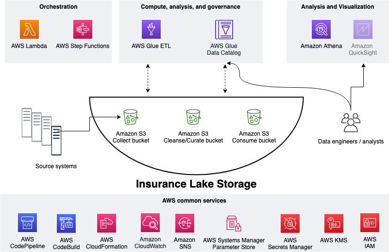
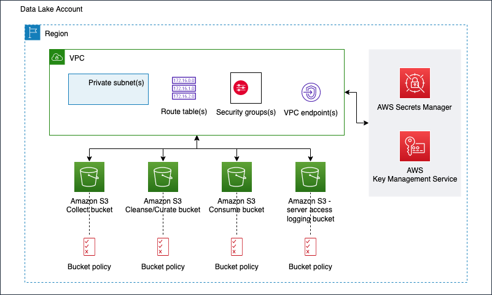
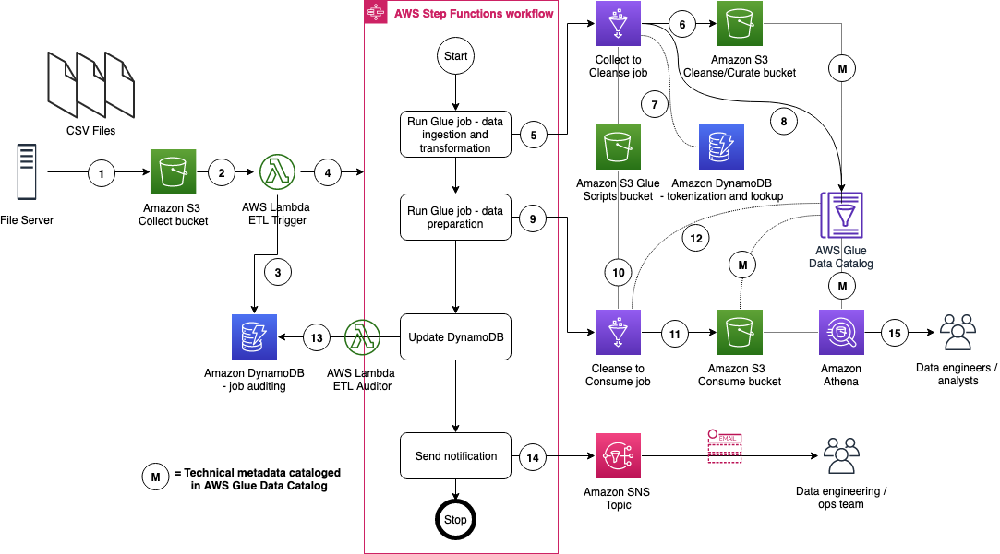

# InsuranceLake Architecture
{: .no_toc }

This section explains the overall InsuranceLake architecture and the components of the ETL.

## Contents
{: .no_toc }

* TOC
{:toc}

## Collect, Cleanse, Consume

As shown in the figure below, we use S3 for storage, specifically three different S3 buckets:
* Collect bucket to store raw data in its original format.
* Cleanse/Curate bucket to store the data that meets the quality and consistency requirements for the data source.
* Consume bucket for data that is used by analysts and data consumers (for example, Amazon Quicksight, Amazon Sagemaker).

InsuranceLake is designed to support a number of source systems with different file formats and data partitions. To demonstrate its use, we have provided several tabular and nested data parsers and sample source system data files, which you can upload to the Collect bucket.

We use Lambda and Step Functions for orchestration and scheduling of ETL workloads. We then use AWS Glue with PySpark for ETL and data cataloging, DynamoDB for transformation metadata, and Athena for interactive queries and analysis. We use various AWS services for logging, monitoring, security, authentication, authorization, notification, build, and deployment.

{: .note }
[AWS Lake Formation](https://aws.amazon.com/lake-formation/) is a service that makes it easy to set up a secure data lake in days. [Amazon QuickSight](https://aws.amazon.com/quicksight/) is a scalable, serverless, embeddable, machine learning-powered business intelligence (BI) service built for the cloud. [Amazon DataZone](https://aws.amazon.com/datazone/) is a data management service that makes it faster and easier for customers to catalog, discover, share, and govern data stored across AWS, on premises, and third-party sources. These three services are not used in this solution but can be added.

## Infrastructure

The figure below represents the infrastructure resources we provision for the data lake.

* S3 buckets for:
    * Collected (raw) data
    * Cleansed and Curated data
    * Consume-ready (prepared) data
    * Server access logging
* Optional Amazon Virtual Private Cloud (Amazon VPC)
    * Subnets
    * Security groups
    * Route table(s)
    * Amazon VPC endpoints
* Supporting services, such as AWS Key Management Service (KMS)

The [InsuranceLake infrastructure codebase](https://github.com/aws-solutions-library-samples/aws-insurancelake-infrastructure) is available on GitHub.

## ETL

The figure below represents the ETL resources we provision for the data lake.

1. A file server uploads files to the Collect bucket of InsuranceLake; file server is a data producer or source for the data lake.
1. S3 triggers an ObjectCreated event notification to Lambda function.
1. The Lambda function inserts job information in an DynamoDB table.
1. The Lambda function starts an execution of Step Functions State machine.
1. This step runs the first AWS Glue job: initiates data processing from Collect to Cleanse.
1. An AWS Glue job will process the data from Collect to Cleanse; source data is assumed to be in CSV format and will be converted to Parquet format.
1. DynamoDB stores original values from PII tokenization, and provides lookup data to the AWS Glue job.
1. After creating Apache Parquet data, the job updates the AWS Glue Data Catalog table.
1. In this step the second AWS Glue job initiates data processing from Cleanse to Consume.
1. The AWS Glue Cleanse to Consume job fetches data transformation rules from AWS Glue etl-scripts bucket, and runs transformations.
1. The AWS Glue job stores prepared data in Apache Parquet format in the Consume bucket.
1. The AWS Glue job updates the AWS Glue Data Catalog table.
1. The AWS Glue job updates the DynamoDB table with job status.
1. Step Functions sends an SNS notification.
1. Data engineers or analysts analyze data using Athena.

The [InsuranceLake ETL codebase](https://github.com/aws-solutions-library-samples/aws-insurancelake-etl) is available on GitHub.