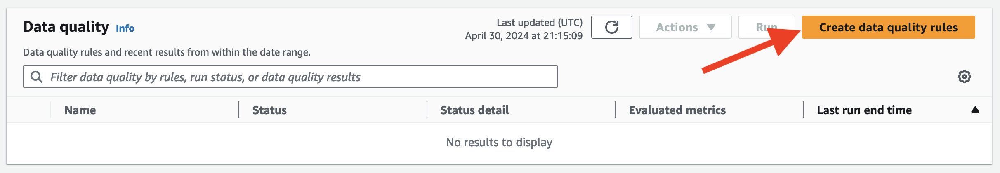
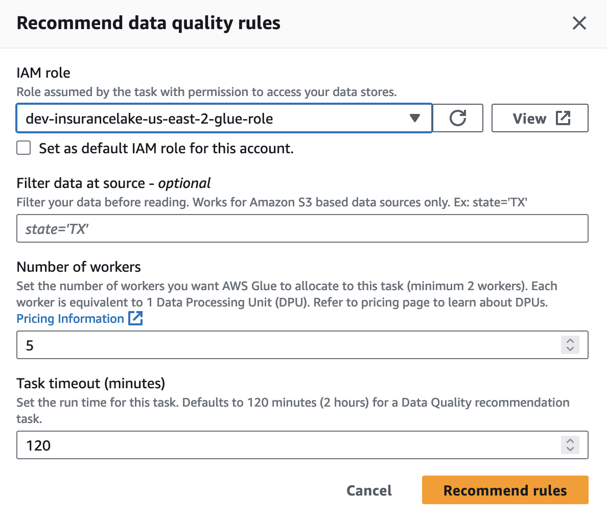
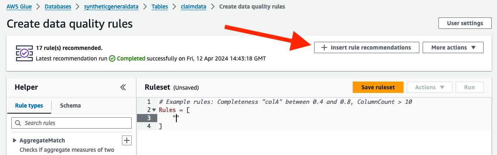

# Data Quality with Glue Data Quality Reference

## Contents

* [Getting Started](#getting-started)
* [Configuration](#configuration)
* [CustomSQL and ETL Behavior Notes](#customsql-and-etl-behavior-notes)
* [Using Data Freshness to Manage Dependent Workflows](#using-data-freshness-to-manage-dependent-workflows)


## Getting Started

Generally, we recommend loading your data into Glue Catalog with minimal or no transforms as a first step to building data quality rules. After loading your data, AWS Glue Data Quality Recommendations and AWS Glue Studio can help build rules based on exploring and understanding the data.

Consider the following steps for building and testing new data quality rules:

1. Load your data using InsuranceLake (Cleanse and/or Consume bucket)
    - To build and test `before_transform` rules, ensure that you have a minimal transform specification defined for your dataset
    - To build and test `after_transform` rules, ensure that your have an as complete as possible transform specification defined for your dataset
    - To build and test `after_sparksql` rules, ensure that you have a Spark SQL file configured as complete as possible for your dataset
1. Navigate to the database and table in the Glue Catalog
    - For `before_transform` and `after_transform` rules, choose the table in the Cleanse bucket
    - For `after_sparksql` rules, choose the table in the Consume bucket
1. Click on the Data Quality tab and scroll down
1. Click on the `Create data quality rules` button to open the the recommendation configuration
    
1. Select the IAM role for Glue created by InsuranceLake
    
1. After the analyzer runs, recommendations will be avilable to add to your set of rules
    
1. Insert recommendations, create your own rules, and test run the rules using the console interface
    - For more details, see the AWS Glue documentation [Getting started with AWS Glue Data Quality for the Data Catalog](https://docs.aws.amazon.com/glue/latest/dg/data-quality-getting-started.html)
1. Copy and paste the rules into the `dq-rules` [configuration file](#configuration) for your dataset
1. Replace double quotes in the rule definitions with single quotes so that you have valid JSON

You can also refer to the [Getting started with AWS Glue Data Quality for ETL Pipelines](https://aws.amazon.com/blogs/big-data/getting-started-with-aws-glue-data-quality-for-etl-pipelines/) blog for guidance and examples.


## Configuration

Data quality in InsuranceLake is provided using Glue Data Quality rules managed in a per-workflow JSON configuration file. 

The filename of the workflow's data quality rules configuration file follows the convention of `dq-<database name>-<table name>.json` and is stored in the `/etl/dq-rules` folder in the `etl-scripts` bucket. When using CDK for deployment, the contents of the `/lib/glue_scripts/lib/dq-rules` directory will be automatically deployed to this location.

The ETL's Glue Data Quality integration uses the [Glue Data Quality Definition Language (DQDL)](https://docs.aws.amazon.com/glue/latest/dg/dqdl.html) to describe rules. The rules in the InsuranceLake ETL data quality configuration should be expressed in the same format (except for the JSON requirements around double quotes).

InsuranceLake data quality configuration supports three locations in the data pipeline to enforce quality rules:

1. Before Transforms: `before_transform`
    * Rules are enforced immediately after schema mapping is completed, but before any transforms are run, including the addition of partition and execution ID columns. This stage is within the Collect-to-Cleanse Glue Job run.
    * Quarantined data is published in the Cleanse database with a table name of `<table name>_quarantine_before_transforms`.
    * Quarantined data is stored in S3 in the Cleanse bucket in the folder `/quarantine/before_transforms/<database name>/<table name>`.
    * This is a good pipeline location to check for date formats, currency formats, or other field values that the transforms will expect.

1. After Transforms: `after_transform`
    * Rules are enforced after all transforms have been run. This stage is just before saving the data to the Cleanse bucket, during the Collect-to-Cleanse Glue Job run.
    * Quarantined data is published in the Cleanse database with a table name of `<table name>_quarantine_after_transforms`.
    * Quarantined data is stored in S3 in the Cleanse bucket in the folder `/quarantine/after_transforms/<database name>/<table name>`.
    * This is a good pipeline location to compare date values, check calculations, and to create a quarantine that looks similar to the cleanse bucket schema.

1. After Spark SQL: `after_sparksql`
    * Rules are enforced after running the Spark SQL command for the workflow, if, and only if, there is one present. This stage is run during the Cleanse-to-Consume Glue Job run before the Athena SQL is run.
    * Rules in this stage can reference multiple tables if those tables are joined or unioned in the Spark SQL. The `primary` table is still the only one available to reference.
    * Quarantined data is published in the Consume database, `<database name>_consume`, with a table name of `<table name>_quarantine_after_sparksql`.
    * Quarantined data is stored in S3 in the Cleanse bucket in the folder `/quarantine/after_sparksql/<database name>/<table name>`.
    * This is a good pipeline location to compare field values from multiple tables that are joined in the Spark SQL.

Keep in mind that the schema of your data at each of the above stages will likely be different. Ensure you are using the right field names and assumptions around the data at each stage of the pipeline.

InsuranceLake data quality configuration supports three types of actions to take when rules fail. All three actions are available for all three locations in the pipeline.

* Warn: `warn_rules`
    - A data quality rule failure message is logged to the Glue job output log.
    - Warn rules are useful to test new data quality rules or tighter data controls prior to using them to quarantine the data or halt the pipeline.

* Quarantine: `quarantine_rules`
    - Individual rows that fail the quality check are removed from the incoming data and stored in a separate quarantine storage location and Glue Catalog table.
    - The Glue Catalog table for each data quality location will be created regardless of whether any rows are quarantined. If no rows are quarantined, the table will be empty. This behavior facilitates setting up connections to quarantined data before encountering any.
    - When re-loading data for an existing partition, the ETL Glue jobs clear the specific partition from each of the quarantine storage locations and tables.
    - The schema of the quarantined data will reflect the schema of the data at the respective stage of the data pipeline. To handle these schema differences, quarantined data will be published in different tables and locations in S3 for each stage of the pipeline (as indicated above).
    - The data quality expression must rely on row level outcomes to evaluate and quarantine individual rows. See [Custom SQL and ETL Behavior](#customsql-and-etl-behavior-notes) for examples.
    - Rules that rely on ratios or thresholds are not supported as quarantine rules. See the [How Composite rules work](https://docs.aws.amazon.com/glue/latest/dg/dqdl.html#dqdl-syntax-composite-rules) in the AWS Glue Data Quality Documentation for more details.

* Halt: `halt_rules`
    - The Glue job is halted immediately. This action is run last so that the other rules are always evaluated.
    - Quarantine rules run before the halt rules **do not affect** the data used to evaluate the halt rules. In other words, even if a row is quarantined, it can still cause the pipeline to halt if it fails a halt rule.


Example data quality configuration file:

```json
{
    "before_transform": {
        "quarantine_rules": [
            "ColumnValues 'StartDate' matches '\\d{1,2}/\\d{1,2}/\\d\\d'",
            "ColumnValues 'EndDate' matches '\\d\\d-\\d{1,2}-\\d{1,2}'",
            "ColumnDataType 'EffectiveDate' = 'DATE'",
            "ColumnDataType 'ExpirationDate' = 'DATE'",
            "ColumnDataType 'GenerationDate' = 'TIMESTAMP'"
        ]
    },
    "after_transform": {
        "warn_rules": [
            "Completeness 'EarnedPremium' > 0.80",
            "ColumnValues \"WrittenPremiumAmount\" >= 0",
            "ColumnValues 'WrittenPremiumAmount' < 10000000",
            "ColumnValues 'NewOrRenewal' in [ 'New', 'Renewal' ]"
        ],
        "quarantine_rules": [
            "ColumnValues 'WrittenPremiumAmount' <= 1500000"
        ],
        "halt_rules": [
            "(ColumnExists 'StartDate') and (IsComplete 'StartDate')",
            "(ColumnExists 'PolicyNumber') and (IsComplete 'PolicyNumber')",
            "CustomSql 'SELECT COUNT(*) FROM primary WHERE EffectiveDate > ExpirationDate' = 0"
        ]
    },
    "after_sparksql": {
        "quarantine_rules": [
            "CustomSql 'SELECT PolicyNumber FROM primary WHERE accidentyeartotalincurredamount <= earnedpremium'"
        ]
    }
}
```


## CustomSQL and ETL Behavior Notes

* Glue Data Quality CustomSQL shares its syntax with Spark SQL with some limitations. Refer to the [AWS Glue DQDL documentation on CustomSQL](https://docs.aws.amazon.com/glue/latest/dg/dqdl.html#dqdl-rule-types-CustomSql) for specific examples as well as the [Apache Spark SQL Reference documentation](https://spark.apache.org/docs/latest/sql-ref.html).

* There are two forms of CustomSQL rules. Only the second is suitable for quarantine rules, because it can identify individual rows that pass or fail:
    1. Retrieve an overall rule outcome
        * `CustomSql 'SELECT COUNT(*) FROM primary WHERE EffectiveDate > ExpirationDate' = 0`
    1. Retrieve a row level outcome
        * `CustomSql 'SELECT PolicyNumber FROM primary WHERE EffectiveDate <= ExpirationDate'`

* The table expression `primary` refers to the incoming tabular data set and must be identified with the name `primary` regardless of the table name in the Spark Hive Catalog / Glue Data Catalog.

* Only the incoming data is available as a single table source (`primary`) in a CustomSQL data quality rule within the InsuranceLake ETL.
    * It is possible to enforce data quality rules across multiple datasets by joining the tables in the pipeline's Spark SQL and uniquely identifying any duplicate fields needed for the data quality checks. See [Using Data Freshness to Manage Dependent Workflows](#using-data-freshness-to-manage-dependent-workflows) for an example.
    * This limitation results in multi-dataset rules being unusable from the InsuranceLake ETL (for example, `DatasetMatch`, `ReferentialIntegrity`, `SchemaMatch`, and `RowCountMatch`).
        * NOTE: A rule that supports an optional external reference (for example `AggregateMatch`) can only be used on columns in the primary dataset.

* A failing `after_sparksql` rule will not rollback the data saved to the **Cleanse bucket** in the same workflow execution.

* Refer to [Measure performance of AWS Glue Data Quality for ETL pipelines](https://aws.amazon.com/blogs/big-data/measure-performance-of-aws-glue-data-quality-for-etl-pipelines/) for detailed information on data quality rule performance and cost.


## Using Data Freshness to Manage Dependent Workflows

In this section, we show an alternative to the traditional approach of building dependency trees for data pipeline jobs to ensure that the most recent dependent data is joined and published.

Suppose we have a policy dataset and a claim dataset. The source systems provide claim updates daily, and policy updates monthly. Each dataset has a separate data pipeline: The policy data pipeline joins the claim data in the Cleanse-to-Consume job, and depends on the claim data to have run and have recent data. Both policy and claim data pipelines collect source data, normalize the schema, and publish to the cleanse bucket.

We can use [AWS Glue DQDL CustomSQL](https://docs.aws.amazon.com/glue/latest/dg/dqdl.html#dqdl-rule-types-CustomSql) checks in the `after-sparksql` stage of the pipeline to ensure both sets of data meet the business requirements for freshness, and halt the pipeline if the check fails. We will assume that at least one claim update will occur each day, and that during normal operations the claim data upload will occur a few hours before the policy data upload.

Notes:
- We use CustomSQL expressions to check data freshness, because it has the most functionality within Glue Data Quality. Specifically, DataFreshness does not support `with threshold` at this time, and ColumnValues does not support `with threshold` with date comparisons. Date comparisons with DataFreshness and ColumnValues are also limited to days and hours.
- We exclude null (empty) claim last updated dates, because this simply means that the policy had no claims, which does not tell us if the data was updated. The empty values for last updated dates is an intended result of the `LEFT OUTER JOIN`. Null claim last updated dates will not be counted towards our threshold.
- We assume that at least one policy will have a claim each day (an empty claim data set should not be processed).

Use Spark SQL to join the policy and claim data, each with a uniquely named last updated field:
```sql
SELECT
      policies.startdate
    , policies.enddate
    , policies.policynumber
    , effectivedate
    , expirationdate
    , claims.accidentyeartotalincurredamount

    -- Uniquely select all last_updated fields to use for DataFreshness checks
    , policies.last_updated as policies_last_updated
    , claims.last_updated as claims_last_updated

    , policies.execution_id
    , policies.year
    , policies.month
    , policies.day

FROM
    syntheticgeneraldata.policydata policies
LEFT OUTER JOIN
    syntheticgeneraldata.claimdata claims
    ON policies.policynumber = claims.policynumber
    AND policies.startdate = claims.startdate
```

Use data quality rules to require (a failing rule halts the pipeline) claim data updates every 24 hours, and policy updates every month; generate warnings for claim data older than 8 hours and policy data older than 30 days, but with a minimum of 100 new policies:
```json
{
    "after_sparksql": {
        "warn_rules": [
            "CustomSql 'SELECT count(*) FROM primary WHERE claims_last_updated >= now() - interval 8 hours' >= 1",
            "CustomSql 'SELECT count(*) FROM primary WHERE policies_last_updated >= now() - interval 1 month' >= 100"
        ],
        "halt_rules": [
            "CustomSql 'SELECT count(*) FROM primary WHERE claims_last_updated >= now() - interval 24 hours' >= 1",
            "CustomSql 'SELECT count(*) FROM primary WHERE policies_last_updated >= now() - interval 1 month' >= 1"
        ]
    }
}
```