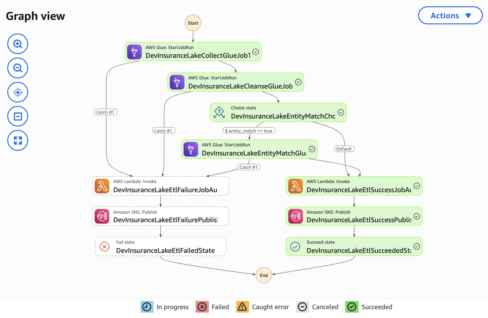
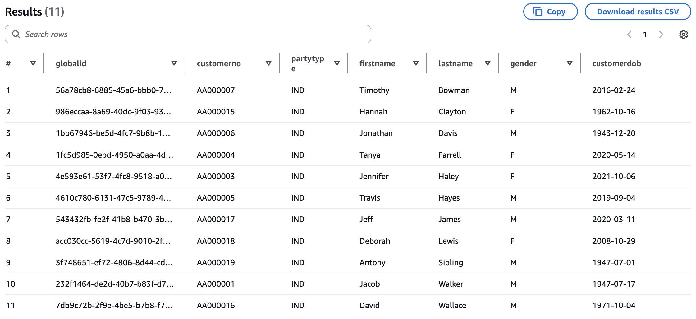
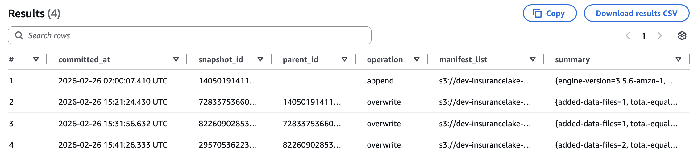
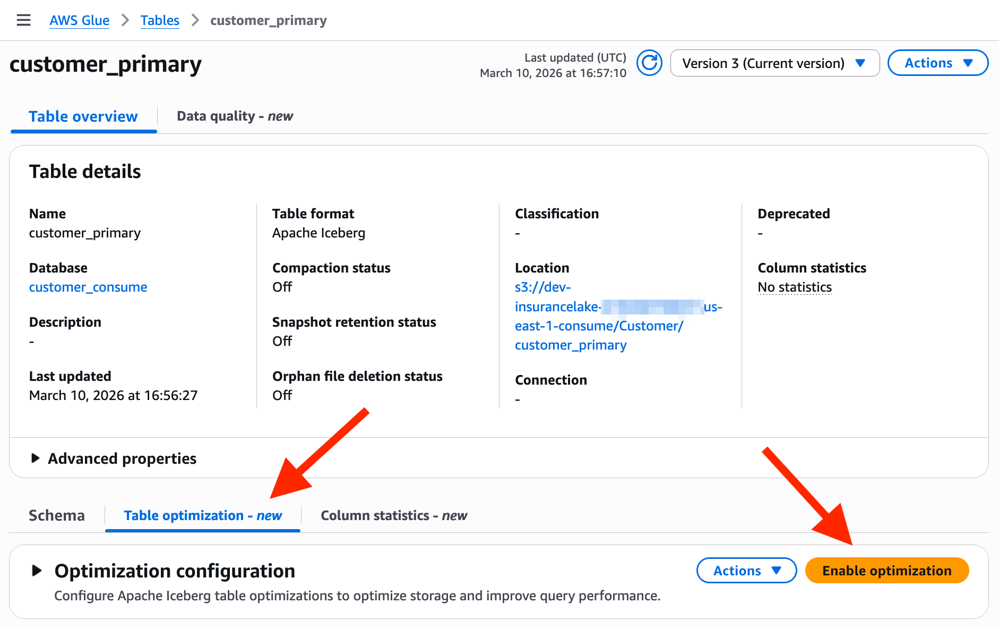

# Entity Matching with InsuranceLake
{: .no_toc }

This section provides instructions for using and configuring the entity matching capability of InsuranceLake.

For developers looking to understand or extend the Entity Match job implementation, refer to the [Entity Matching Developer Guide](entity_match_developer_guide.md#entity-matching-implementation).


## Contents
{: .no_toc }

* TOC
{:toc}


## Overview

Entity matching in InsuranceLake enables you to identify and link records that refer to the same real-world entity across different data sources or within the same data source over time. This capability is essential for creating a unified view of customers, policies, claims, and other insurance entities.

This capability is an alternative to the [AWS Entity Resolution](https://aws.amazon.com/entity-resolution/) service and utilizes the OpenSource [Python Record Linkage Toolkit](https://pypi.org/project/recordlinkage/) for the matching implementation.

InsuranceLake implementes this feature using the Entity Match AWS Glue ETL job, [`etl_consume_entity_match.py`](https://github.com/aws-solutions-library-samples/aws-insurancelake-etl/blob/main/lib/glue_scripts/etl_consume_entity_match.py). This ETL job operates on data in the Consume layer of your data lake and maintains a primary entity table using [Apache Iceberg](https://iceberg.apache.org/docs/latest/) also located in the Consume layer. When new data is loaded, the job:

1. Checks for pre-assigned global IDs in the incoming data.
1. Performs exact matching based on source system identifiers.
1. Applies probabilistic matching using the Python recordlinkage library.
1. Assigns new global IDs to unmatched entities.
1. Merges the results into the primary entity table using Apache Iceberg.

### Key Features
{: .no_toc }

- **Multiple Matching Strategies**: Combines exact matching and fuzzy matching for flexible entity resolution.
- **Per-entity Configurable Matching Rules**: Define custom blocking strategies and field comparisons through JSON configuration for each entity type.
- **Flexible Matching Levels**: Support for multiple matching passes with different thresholds and field combinations.
- **Incremental Processing**: Efficiently processes only new data while maintaining historical entity relationships.
- **Schema Evolution Support**: Leverages Apache Iceberg's schema evolution capabilities.
- **Global ID Management**: Automatically generates and maintains unique identifiers across all entity records.


## Quickstart

To get started quickly with entity matching and the sample data provided by InsuranceLake, follow these instructions.

{: .note}
Following these instructions will incur **an approximate cost of $1** in addition to any costs incurred from following the InsuranceLake Quickstart guide. For detailed information on InsuranceLake costs, review the [Cost documentation](overview_cost.md).

### Prerequisites

- InsuranceLake deployed to an AWS environment following the [InsuranceLake Quickstart](quickstart.md) guide.
- Access to the AWS Console.
- Access to sample customer data files from the [`resources`](https://github.com/aws-solutions-library-samples/aws-insurancelake-etl/tree/main/resources) folder of the InsuranceLake ETL OpenSource repository.
- Understanding of how to monitor ETL job progress using AWS Step Functions in the AWS Console.

### Review the Provided Sample Data

The InsuranceLake repository includes four customer data files from three policy management systems designed to demonstrate the entity matching capability by creating a complete view of customers. Each system represents a different line of business and stores customer data uniquely.

- `customer_A01_entitymatch_day1.csv` - Initial load from System A01 (11 customers)
- `customer_C25_entitymatch_day1.csv` - Load from System C25 (9 customers, some matches with A01 and F15)
- `customer_F15_entitymatch_day1.csv` - Load from System F15 (3 customers, some matches with A01 and C25)
- `customer_A01_entitymatch_day2.csv` - Second load from System A01 (5 customers, some with variations)

These files contain customer records with intentional variations to demonstrate matching and historical snapshots:
- Same customers with different IDs across systems (AA000001 vs C0000001)
- Name variations (Jennifer vs Irina, Deborah vs Deb, Timothy vs Tim)
- Address changes (different streets for the same person)
- Truncated names (Travis Hayes vs Trav H, Jonathan Davis vs Jonathan D)

### Load Provided Sample Data

1. Open AWS `CloudShell` from within the AWS Console.

    {: .warning}
    The following steps rely on a clone of the InsuranceLake ETL repository existing in your CloudShell home directory. If AWS has deleted the data due to inactivity, you will need to repeat Steps 1 - 4 of the [Quickstart](quickstart.md) guide.

1. Change the working directory to the location of the etl code.
    ```bash
    cd aws-insurancelake-etl
    ```

1. Upload the first data file for system A01 to the Collect S3 bucket using the provided shell command.

    ```bash
    export AWS_ACCOUNT_ID=$(aws sts get-caller-identity --query Account --output text)
    aws s3 cp resources/customer_A01_entitymatch_day1.csv s3://dev-insurancelake-${AWS_ACCOUNT_ID}-${AWS_DEFAULT_REGION}-collect/Customer/A01/
    ```

    This will trigger the InsuranceLake ETL workflow, processing the data through Collect-to-Cleanse, Cleanse-to-Consume, and Consumer-EntityMatch.

1. Use [Step Functions](https://console.aws.amazon.com/states/home) to monitor the workflow until complete.

    

    When complete, the ETL workflow will have:
    - Created the `customer_primary` table in the Consume layer.
    - Assigned a unique global ID to each of the customers from system A01.
    - Created the first Iceberg snapshot.

1. Use [Athena](https://console.aws.amazon.com/athena/home) to query the primary entity table for the customer record.

    ```sql
    SELECT *
    FROM customer_consume.customer_primary
    ORDER BY lastname, firstname;
    ```

    You should see 11 records, each with a unique global ID.

    

1. In CloudShell, upload the data from system C25 to the Collect S3 bucket using the provided shell command.

    ```bash
    aws s3 cp resources/customer_C25_entitymatch_day1.csv s3://dev-insurancelake-${AWS_ACCOUNT_ID}-${AWS_DEFAULT_REGION}-collect/Customer/C25/
    ```

1. Use [Step Functions](https://console.aws.amazon.com/states/home) to monitor the workflow until complete.

    When complete, the ETL workflow will have added 2 new customers and performed matching with the existing customer data, for example:
    - C0000001 (Jacob Walker) matches AA000001 via date of birth and name.
    - C0000018 (Deb Lew) matches AA000018 via fuzzy name matching.
    - C0000019 (James Steele) matches AA000019 via exact match.

1. Upload the data from system F15 to the Collect S3 bucket using the provided shell command.

    ```bash
    aws s3 cp resources/customer_F15_entitymatch_day1.csv s3://dev-insurancelake-${AWS_ACCOUNT_ID}-${AWS_DEFAULT_REGION}-collect/Customer/F15/
    ```

1. Use [Step Functions](https://console.aws.amazon.com/states/home) to monitor the workflow until complete.

    When complete, the ETL workflow will have added 1 new customer and performed the following matching with the existing customer data:
    - F0000002 (D Lewis) matches C0000018 via fuzzy name matching and exact date of birth.
    - F0000003 (J Walker) matches C0000001 via fuzzy name matching and exact date of birth.

1. Upload the second day data file for system A01 to the Collect S3 bucket using the provided shell command.

    {: .note}
    The following shell command overrides the partition values to ensure that the second day of data from A01 does not overwrite the prior day of data you loaded in step 3. For more information on how this works, refer to the [InsuranceLake User Documentation Loading Data Override Partition Values](loading_data.md#override-partition-values).

    ```bash
    aws s3 cp resources/customer_A01_entitymatch_day2.csv s3://dev-insurancelake-${AWS_ACCOUNT_ID}-${AWS_DEFAULT_REGION}-collect/Customer/A01/`date -d "tomorrow 13:00" +%Y/%m/%d`/
    ```

1. Use [Step Functions](https://console.aws.amazon.com/states/home) to monitor the workflow until complete.

    When complete, the ETL workflow will have performed the following additions and matching with the existing customer data:
    - 2 exact matches (AA000003, AA000019) - will match via exact matching
    - 2 fuzzy matches (AA000001, AA000018) - will match via recordlinkage
    - 1 new customer (AA000020: Devon Martin)


### Verify Matching Results

21. Using Athena, query the primary entity table for the customer record again.

    ```sql
    SELECT *
    FROM customer_consume.customer_primary
    ORDER BY lastname, firstname;
    ```

    You should now see:
    - 14 total records all with a unique global ID
    - Customer numbers from 3 different systems
    - Two values for partition column `day`

1. Query the Apache Iceberg snapshots table to view a history of all changes to the primary entity table.

    ```sql
    SELECT *
    FROM customer_consume."customer_primary$snapshots"
    ORDER BY committed_at;
    ```

    

    For more information on Apache Iceberg metadata queries with Athena, refer to the [AWS documentation](https://docs.aws.amazon.com/athena/latest/ug/querying-iceberg-table-data.html).

1. Query the primary entity table as it existed after the first load to show how time travel is possible using Apache Iceberg snapshots.

    {: .note}
    Replace the `<snapshot_id_from_day1>` text below with the `snapshot_id` value from the first row of query output in the above step.

    ```sql
    SELECT *
    FROM customer_consume.customer_primary
    FOR VERSION AS OF <snapshot_id_from_day1>;
    ```

    You should see the original 11 records from the initial system A01 customer data load.

    For more information on Apache Iceberg version and time travel queries with Athena, such as relative timestamps, refer to the [AWS documentation](https://docs.aws.amazon.com/athena/latest/ug/querying-iceberg-time-travel-and-version-travel-queries.html).


### Review Supporting Configuration Files

InsuranceLake provides the following sample configuration files to control the workflows used in the guide you just followed. Review the configuration by selecting the links to each file.

|Configuration File |ETL Scripts Bucket Location    |Purpose
|-- |-- |--
|[`Customer-A01.csv`](https://github.com/aws-solutions-library-samples/aws-insurancelake-etl/blob/main/lib/glue_scripts/transformation-spec/Customer-A01.csv) |/etl/transformation-spec   |Schema mapping for system A01 customer data
|[`Customer-C25.csv`](https://github.com/aws-solutions-library-samples/aws-insurancelake-etl/blob/main/lib/glue_scripts/transformation-spec/Customer-C25.csv) |/etl/transformation-spec   |Schema mapping for system C25 customer data
|[`Customer-F15.csv`](https://github.com/aws-solutions-library-samples/aws-insurancelake-etl/blob/main/lib/glue_scripts/transformation-spec/Customer-F15.csv) |/etl/transformation-spec   |Schema mapping for system F15 customer data
|[`Customer-A01.json`](https://github.com/aws-solutions-library-samples/aws-insurancelake-etl/blob/main/lib/glue_scripts/transformation-spec/Customer-A01.json)   |/etl/transformation-spec   |Transform configuration for system A01 customer data
|[`Customer-C25.json`](https://github.com/aws-solutions-library-samples/aws-insurancelake-etl/blob/main/lib/glue_scripts/transformation-spec/Customer-C25.json)   |/etl/transformation-spec   |Transform configuration for system C25 customer data
|[`Customer-F15.json`](https://github.com/aws-solutions-library-samples/aws-insurancelake-etl/blob/main/lib/glue_scripts/transformation-spec/Customer-F15.json)   |/etl/transformation-spec   |Transform configuration for system F15 customer data
|[`spark-Customer-A01.sql`](https://github.com/aws-solutions-library-samples/aws-insurancelake-etl/blob/main/lib/glue_scripts/transformation-sql/spark-Customer-A01.sql)   |/etl/transformation-sql   |Consume layer view for system A01 customer data
|[`spark-Customer-C25.sql`](https://github.com/aws-solutions-library-samples/aws-insurancelake-etl/blob/main/lib/glue_scripts/transformation-sql/spark-Customer-C25.sql)   |/etl/transformation-sql   |Consume layer view for system C25 customer data
|[`spark-Customer-F15.sql`](https://github.com/aws-solutions-library-samples/aws-insurancelake-etl/blob/main/lib/glue_scripts/transformation-sql/spark-Customer-F15.sql)   |/etl/transformation-sql   |Consume layer view for system F15 customer data
|[`Customer-entitymatch.json`](https://github.com/aws-solutions-library-samples/aws-insurancelake-etl/blob/main/lib/glue_scripts/transformation-spec/Customer-entitymatch.json) |/etl/transformation-spec   |Entity matching configuration for all systems that provide customer data


## Configuration Details

Entity matching is configured using a JSON specification file stored in the ETL Scripts S3 bucket. The filename follows the convention `<database name>-entitymatch.json` and is stored in the `/etl/transformation-spec` folder.

When using AWS CDK for deployment, the contents of the `/lib/glue_scripts/transformation-spec` directory will be automatically deployed to this location.

Unlike other per-workflow configuration files, the entity matching configuration applies to all tables within a database. This convention allows you to group tables that describe a common entity and apply the same matching rules across data from those tables.


### Configuration File Structure

The entity matching configuration file contains the following sections:

|Section    |Type    |Description
|---    |---    |---
|primary_entity_table    |required    |Name of the primary entity table in the Consume layer that stores the master entity records
|global_id_field    |required    |Name of the field that contains the unique global identifier for each entity
|sort_field    |optional    |Name of the field used to determine the most recent record when multiple matches are found
|exact_match_fields    |optional    |Configuration for exact matching based on source system identifiers
|levels    |optional    |Array of matching level configurations for probabilistic record linkage


### Exact Match Fields

The `exact_match_fields` section enables matching based on source system identifiers. This is useful when you have reliable unique identifiers from source systems.

|Parameter    |Type    |Description
|---    |---    |---
|source_system_key    |required    |Name of the field containing the source system identifier (for example, system name, database name)
|source_primary_key    |required    |Name of the field containing the primary key for the entity from the source system (for example, customer number, policy number)

Example:
```json
"exact_match_fields": {
    "source_system_key": "srcsystemid",
    "source_primary_key": "customerno"
}
```


### Matching Levels

The `levels` array defines one or more passes of probabilistic matching. Each level can use different blocking strategies and field comparisons, allowing you to balance accuracy and completeness.

|Parameter    |Type    |Description
|---    |---    |---
|id    |required    |Unique identifier for this matching level (used by the ETL job to uniquely identify the blocking columns)
|blocks    |required    |Array of blocking expressions to reduce the number of record comparisons, use a list of unmodified column names to start
|fields    |required    |Array of field comparison configurations
|threshold    |required    |Minimum score (0.0 to 1.0) required for the level to be considered a match; compared against the weighted average of individual field match scores using user-specified weights

#### Blocking Expressions

Blocking reduces the computational complexity of entity matching by making a subset of the record space. Blocking expressions support [Python-style string slicing](https://docs.python.org/3/reference/expressions.html#slicings) using colon-separated expressions to create subsets of column data.

Examples:
- `"firstname[:1]"` - First character of firstname values
- `"lastname[1:]"` - All characters of lastname values except the first
- `"zip"` - Entire zip code
- `"phonenumber"` - Entire phone number

#### Field Comparison Configuration

Each field in the `fields` array defines how a specific attribute should be compared between records.

|Parameter    |Type    |Description
|---    |---    |---
|fieldname    |required    |Name of the field to compare
|type    |required    |The name, in all lowercase, of any compare algorithm supported by the recordlinkage library, for example, `string`, `exact`, `numeric`, `date`; see the [recordlinkage Compare Algorithms documentation](https://recordlinkage.readthedocs.io/en/latest/ref-compare.html#module-recordlinkage.compare) for a complete list
|weight    |required    |Relative importance of this field (0.0 to 1.0); weights will be normalized using the [Numpy `average` method](https://numpy.org/doc/stable/reference/generated/numpy.average.html#numpy-average)
|method    |optional    |The name, in all lowercase, of a comparison method, specific to the chosen algorithm, if supported; for example, the string algorithm supports `jarowinkler`, `levenshtein`, `damerau_levenshtein`, `qgram`, `cosine`, `smith_waterman`, `longest_common_substring`; the `numeric` and `geographic` algorithms also support a defined method
|threshold    |optional    |Minimum similarity score (0.0 to 1.0) to be considered a match, used by the string algorithm only

For detailed information on comparison methods and their parameters, refer to the [recordlinkage Comparing documentation](https://recordlinkage.readthedocs.io/en/latest/ref-compare.html).


### Complete Configuration Example

```json
{
    "primary_entity_table": "customer_primary",
    "global_id_field": "globalid",
    "sort_field": "lastupdated",
    "exact_match_fields": {
        "source_primary_key": "customerno",
        "source_system_key": "srcsystemid"
    },
    "levels": [
        {
            "id": "1",
            "blocks": [
                "firstname[:1]",
                "lastname[1:]",
                "zip"
            ],
            "fields": [
                {
                    "fieldname": "firstname",
                    "type": "string",
                    "weight": 0.075,
                    "method": "jarowinkler",
                    "threshold": 0.85
                },
                {
                    "fieldname": "lastname",
                    "type": "string",
                    "weight": 0.075,
                    "method": "jarowinkler",
                    "threshold": 0.85
                },
                {
                    "fieldname": "customerdob",
                    "type": "exact",
                    "weight": 0.7
                }
            ],
            "threshold": 0.85
        },
        {
            "id": "2",
            "blocks": [
                "zip"
            ],
            "fields": [
                {
                    "fieldname": "email",
                    "type": "exact",
                    "weight": 0.5
                },
                {
                    "fieldname": "customerdob",
                    "type": "exact",
                    "weight": 0.5
                }
            ],
            "threshold": 1.0
        }
    ]
}
```

This configuration:
1. Uses exact matching on customer number and source system ID
1. Applies two levels of probabilistic matching:
   - Level 1: Matches on name and address with high weight on date of birth
   - Level 2: Matches on email and date of birth with an exact match required


## Workflow Integration

### Prerequisites

To prepare your workflow for running the Entity Match job and creating a primary entity table with global IDs:

1. Load data in the Collect bucket and publish it as AWS Glue Data Catalog tables in the Cleanse layer.

1. Publish data as a Data Catalog table in the Consume layer (database with the _consume suffix) using an SQL configuration file; for example, you can use the [simplest view of the data](using_sql.md#simplest-method-to-populate-consume).

1. Ensure entity attributes needed for matching are part of the Consume layer view.

1. Load data from each relevant source system in a common database.

1. Create an entity matching configuration file in the ETL Scripts S3 bucket for the common database. Refer to the [Configuration Details](#configuration-details) for specific configuration options.

1. Once configured, you can test the pipeline: rerun the workflow for each source system by reloading the source files or by [executing the pipeline without uploading](loading_data.md#execute-pipeline-without-upload).

1. Refer to the [Entity Matching Quickstart Guide](#verify-matching-results) for examples of SQL queries that can be used to validate the entity global ID assignment and matching.


## Matching Process Details

### Matching Workflow

When the Entity Match job runs for the first time (the primary entity table does not exist):

- All incoming records without a global ID are assigned a new unique identifier.
- Records with a pre-assigned global ID retain their identifier.
- A new primary entity table is created with the incoming data.
- No matching is performed since there are no existing entities to match against.

For subsequent workflows when the primary entity table exists and contains data, the Entity Match job follows this workflow:

1. **Load Incoming Data**: Read the specified partition from the Consume layer table
1. **Add Global ID Field**: If the global ID field does not exist, add it with null values
1. **Split Pre-matched Records**: Separate records that already have a global ID assigned
1. **Exact Matching**: Match remaining records using source system identifiers
1. **Probabilistic Matching**: Apply recordlinkage matching levels sequentially
1. **Assign New IDs**: Generate global IDs for any remaining unmatched records
1. **Merge Results**: Combine all matched and new records
1. **Update Primary Table**: Merge results into the primary entity table using Apache Iceberg `MERGE INTO`

{: .important}
> The incoming data processed by the Entity Match job is specifically the incoming data in the latest partition from the Consume layer table. It is _not_ the entire Consume table. Specifically, the Entity Match job uses the following query to retrieve the incoming data from the Consume layer table:
> ```sql
> SELECT * FROM `{consume_database}`.`{source_table}`
>     WHERE year == '{p_year}' AND month == '{p_month}' AND day == '{p_day}'
> ```


### Apache Iceberg on AWS

AWS Glue supports mutiple table optimization options to enhance the management and performance of Apache Iceberg tables. The supported table optimizations are compaction, snapshot retention, and orphan file deletion.

By default, automated optimization for Apache Iceberg tables is disabled for newly created tables. Follow the steps below to enable all three optimizations using the default settings.

{: .warning}
When you enable table optimization, AWS Glue optimization tasks will run automatically and incur regular cost. The cost of using the default settings on the sample Customer data provided by InsuranceLake is approximately $2/month. This cost estimate is based on 2 minutes of runtime for each of the 3 optimization tasks; the compaction task runs once a week, and the snapshot deletion and orphan file deletion run once a day.

#### Enable AWS Glue Iceberg Optimization
{: .no_toc }

1. Open [AWS Glue Databases](https://console.aws.amazon.com/glue/home#/v2/data-catalog/databases) in the AWS Console.

1. Select the `customer_consume` database.

1. Select the `customer_primary` table.

1. Select the `Table optimization` tab part way down the page.

1. Select `Enable optimization`.

    

1. Leave the selection of `Use default settings`.

1. In the IAM role drop down, search and select the `dev-insurancelake-us-east-2-glue-role`.

    {: .note}
    If your deployment of InsuranceLake uses a different region or deployment environment, your AWS Glue service role name will be different.

1. Check the box for `I acknowledge that expired data will be deleted as part of the optimizers.` to indicate you understand how expiring snapshots are handled.

1. Select `Enable optimization`.

1. Review all the `Table optimization` tab sections, which show the current configuration and the history of each optimization task.

#### Additional Iceberg on AWS Resources
{: .no_toc }

- [AWS Documentation Optimizing Iceberg Tables](https://docs.aws.amazon.com/glue/latest/dg/table-optimizers.html)
- [Developing locally with Iceberg Tables and Glue v4](developer_guide.md#local-apache-iceberg-development-in-glue-v4)