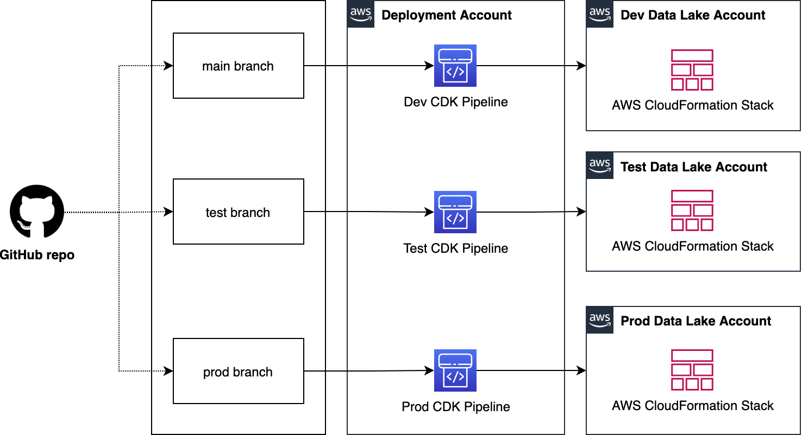
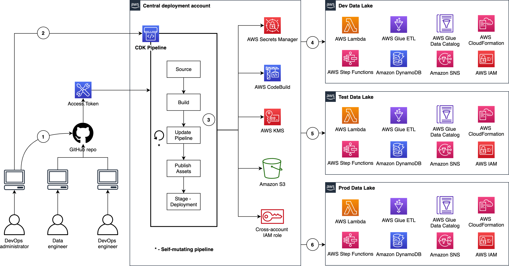
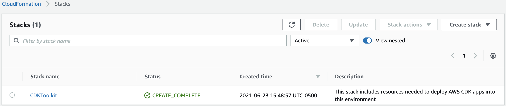
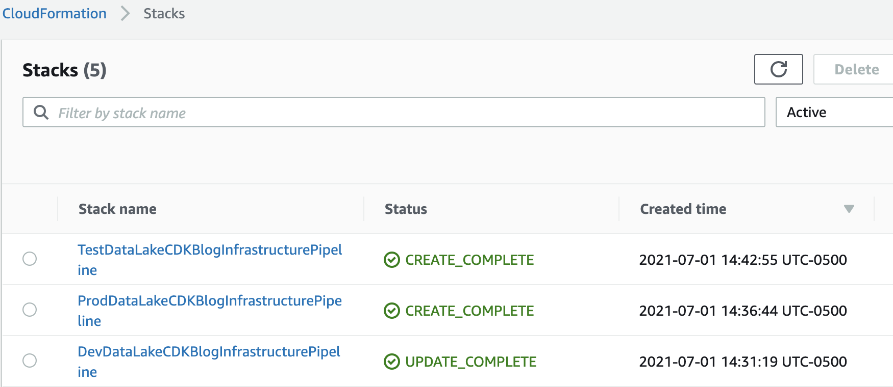
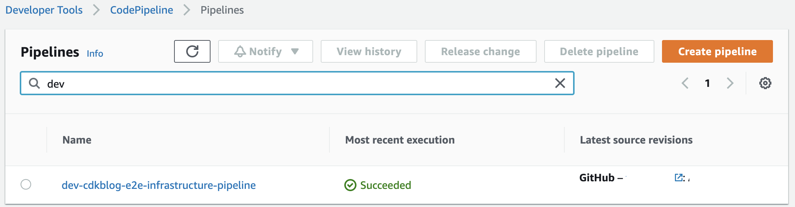
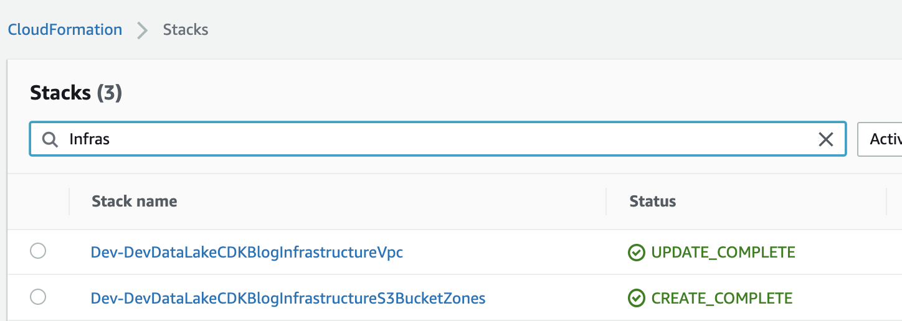
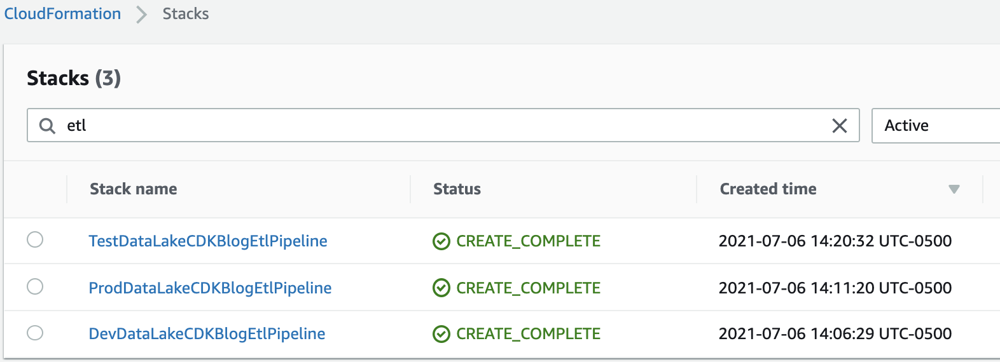
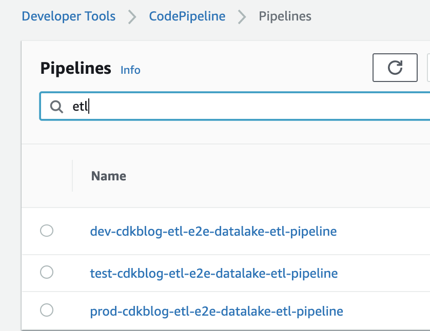
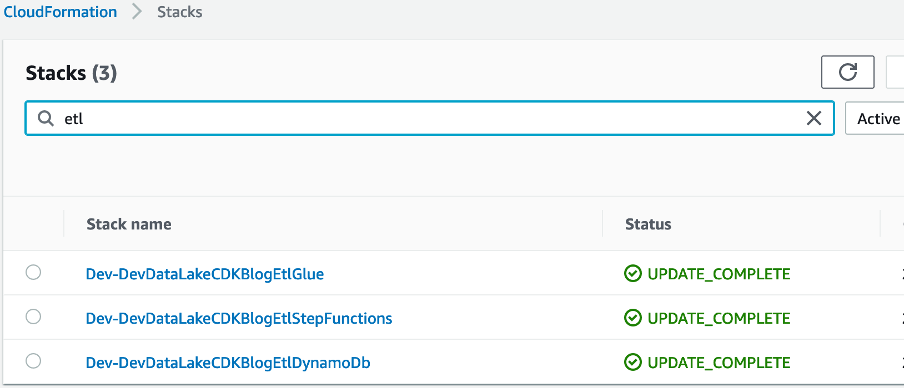

# InsuranceLake Full Deployment Guide

This section provides complete instructions for three deployment environments, and a separate central deployment account for pipelines.

---

## Contents

* [Explanation](#explanation)
  * [Logistical Requirements](#logistical-requirements)
  * [Self-mutating Pipelines via CDK](#self-mutating-pipelines-via-cdk)
  * [Centralized Deployment](#centralized-deployment)
  * [Continuous Delivery of Data Lake Infrastructure using CDK Pipelines](#continuous-delivery-of-data-lake-infrastructure-using-cdk-pipelines)
* [Deployment](#deployment)
  * [Software Installation](#software-installation)
  * [AWS Environment Bootstrapping](#aws-environment-bootstrapping)
  * [Application Configuration](#application-configuration)
  * [AWS CodePipeline and GitHub Integration](#aws-codepipeline-and-github-integration)
  * [AWS CodePipeline and Bitbucket Integration](#aws-codepipeline-and-bitbucket-integration)
  * [Deploying CDK Stacks](#deploying-cdk-stacks)

---

## Explanation

### Logistical Requirements

* **Four AWS accounts for full deployment** One of them acts like a central deployment account. The other three are for development, test, and production accounts. To test this solution with a single account refer to the [Quickstart guide](../README.md#quickstart) for detailed instructions.

* **Number of branches on your GitHub repo** You need to start with at least one branch (e.g. main) to start using this solution. Test and prod branches can be added at the beginning or after the deployment of the data lake infrastructure on the dev environment.

* **Administrator privileges** You need administrator privileges to bootstrap your AWS environments and complete the initial deployment. Usually, these steps can be performed by a DevOps administrator of your team. After these steps, you can revoke administrative privileges. Subsequent deployments are based on CDK roles and pipeline self-mutation.

* **AWS region selection** We recommend you use the same AWS region (e.g. us-east-2) for deployment, dev, test, and prod accounts for simplicity. However, this is not a hard requirement.

---

### Self-mutating Pipelines via CDK

The pipeline you have created using the CDK Pipelines module is self-mutating. That means the pipeline itself is infrastructure-as-code and can be changed as part of the deployment. During the build stage the pipeline will determine if its own stack is changed, redeploy the pipeline, and repeat the build stage using the new pipeline definition.

---

### Centralized Deployment

Let us see how we deploy data lake ETL workloads from a central deployment account to multiple AWS environments such as dev, test, and prod. As shown in the figure below, we organize **Data Lake ETL source code** into three branches: develop, test, and main. We use a dedicated AWS account to create CDK Pipelines. Each branch is mapped to a CDK pipeline and it turn mapped to a target environment. This way, code changes made to the branches are deployed iteratively to their respective target environment.

To demonstrate this solution, we need 4 AWS accounts as follows:

  1. Central deployment account to create CDK pipelines
  1. Dev account for one or more development data lakes
  1. Test account for testing or staging the data lake
  1. Prod account for the production data lake

Figure below represents the centralized deployment model.



There are few interesting details to point out here:

  1. Each source code repository should be organized into three branches, one for each environment (main branch is often used for production)
  1. Each branch is mapped to a CDK pipeline and a target environment. This way, code changes made to the branches are deployed iteratively to their respective target environment
  1. From CDK perspective, we apply the the following bootstrapping principles
      1. the central deployment account will utilize a standard bootstrap
      1. each target account will require a cross account trust policy to allow access from the centralized deployment account

---

### Continuous Delivery of Data Lake Infrastructure using CDK Pipelines

Figure below illustrates the continuous delivery of ETL resources for the data lake.



There are few interesting details to point out here:

1. The DevOps administrator checks in the code to the repository.
1. The DevOps administrator (with elevated access) facilitates a one-time manual deployment on a target environment. Elevated access includes administrative privileges on the central deployment account and target AWS environments.
1. CodePipeline periodically listens to commit events on the source code repositories. This is the self-mutating nature of CodePipeline. It’s configured to work with and is able to update itself according to the provided definition.
1. Code changes made to the main branch of the repo are automatically deployed to the dev environment of the data lake.
1. Code changes to the test branch of the repo are automatically deployed to the test environment.
1. Code changes to the prod branch of the repo are automatically deployed to the prod environment.

---

## Deployment

### Software Installation

NOTE: If using AWS Cloud9, you need only fork the repository, and proceed to [AWS Environment Bootstrapping](#aws-environment-bootstrapping), as the other software is pre-installed.

1. **AWS CLI** - make sure you have AWS CLI configured on your system. If not, refer to [Configuring the AWS CLI](https://docs.aws.amazon.com/cli/latest/userguide/cli-chap-configure.html) for more details.

1. **Python** - make sure you have [Python](https://www.python.org/downloads/) installed on your system. Python 3.9 and above is required.

1. **Node.js and CDK** - Python CDK requires [Node.js](https://nodejs.org/en/download/package-manager/) and the [Node.js CDK CLI](https://docs.aws.amazon.com/cdk/v2/guide/getting_started.html) to be installed on your system

1. **GitHub Fork** - we recommend you [fork the repository](https://docs.github.com/en/get-started/quickstart/fork-a-repo) so you are in control of deployed resources.

### AWS Environment Bootstrapping

Environment bootstrap is standard CDK process to prepare an AWS environment ready for deployment. Follow the steps:

1. Open a command line interface (terminal)
1. Go to project root directory where [app.py](https://github.com/aws-solutions-library-samples/aws-insurancelake-etl/blob/main/app.py) file exists

1. Create Python virtual environment; this is a one-time activity

    ```bash
   python3 -m venv .venv
   ```

1. Expected output: you will see a folder with name `.venv` created in project root folder. You can run the following command to see its contents: `ls -la .venv`

   ```bash
   total 8
   drwxr-xr-x   6 user_id  staff   192 Aug 30 23:21 ./
   drwxr-xr-x  33 user_id  staff  1056 Sep 14 11:42 ../
   drwxr-xr-x  27 user_id  staff   864 Sep  8 13:11 bin/
   drwxr-xr-x   3 user_id  staff    96 Aug 30 23:21 include/
   drwxr-xr-x   3 user_id  staff    96 Aug 30 23:21 lib/
   -rw-r--r--   1 user_id  staff   328 Aug 30 23:21 pyvenv.cfg
   ```

1. Activate Python virtual environment

   ```bash
   source .venv/bin/activate
   ```

1. Install dependencies

   ```bash
   pip install -r requirements.txt
   ```

1. Expected output: run the below command and verify all dependencies are installed

   ```bash
   ls -la .venv/lib/python3.*/site-packages/
   ```

1. Before you bootstrap the **central deployment account** account, set the AWS_PROFILE environment variable

   ```bash
   export AWS_PROFILE=replace_it_with_deployment_account_profile_name_before_running
   ```

   **Important**:
   1. This command is based on configuration and credential profiles for the AWS CLI ([instructions here](https://docs.aws.amazon.com/cli/latest/userguide/cli-configure-files.html)).
   1. If you want to use an alternative option then refer to [Configuring the AWS CLI](https://docs.aws.amazon.com/cli/latest/userguide/cli-chap-configure.html) and [Environment variables to configure the AWS CLI](https://docs.aws.amazon.com/cli/latest/userguide/cli-configure-envvars.html) for details. Be sure to follow those steps for each configuration step moving forward.

1. Bootstrap central **deployment** account

   **Important:** Your configured environment *must* target the central deplopyment account

   Your account(s) may have already been bootstrapped for CDK. If so, you do not need to bootstrap them again. Using the AWS Console for CloudFormation, check if a stack called `CDKToolkit` exists. If it does, you can skip this step (applies to all accounts).

   By default CDK bootstrapping will use the Administrator Access policy attached to the current session's role. If your organization requires a specific policy for CloudFormation deployment, use the `--cloudformation-execution-policies` command line option to specify the policies to attach.

   Run the following command:

   ```bash
   ./lib/prerequisites/bootstrap_deployment_account.sh
   ```

   If your organization requires specific resource tags, you can pass that tag list on the command line using `--tags`. Multiple tags are passed as follows:

   ```bash
   ./lib/prerequisites/bootstrap_deployment_account.sh --tags 'COSTCENTER'='Analytics' --tags 'AssetID'='555'
   ```

   If your organization requires a permissions boundary attached to all IAM roles, use the following parameter:

   ```bash
   ./lib/prerequisites/bootstrap_deployment_account.sh --custom-permissions-boundary OrgPermissionBoundaryPolicy
   ```
   **NOTE:** Provided permissions boundary will only be applied to the CDK execution role, not the other roles that are created as part of the bootstrap process.

   If your organization requires additional customizations to the bootstrap process, you may need to customize and deploy the bootstrap template. For more information, refer to [the Customizing bootstrapping section of the CDK documentation](https://docs.aws.amazon.com/cdk/v2/guide/bootstrapping.html).


1. When you see the following text, enter `y`, and press enter

   ```bash
   Are you sure you want to bootstrap {
      "UserId": "user_id",
      "Account": "deployment_account_id",
      "Arn": "arn:aws:iam::deployment_account_id:user/user_id"
   }? (y/n)y
   ```

1. Expected outputs:
   1. In your terminal, you see:

      ```bash
      ✅  Environment aws://deployment_account_id/us-east-2 bootstrapped.
      ```

   1. You will see a stack created in your deployment account as follows:

      

   1. You see an S3 bucket created in central deployment account. The name is like `cdk-hnb659fds-<assets-deployment_account_id>-us-east-2`

1. Before you bootstrap the **dev** account, set the AWS_PROFILE environment variable

   ```bash
   export AWS_PROFILE=replace_it_with_dev_account_profile_name_before_running
   ```

1. Bootstrap **dev** account

   1. Enter the following command:

      ```bash
      ./lib/prerequisites/bootstrap_target_account.sh <central_deployment_account_id> arn:aws:iam::aws:policy/AdministratorAccess
      ```

   1. When you see the following text, enter y, and press enter

      ```bash
      Are you sure you want to bootstrap {
         "UserId": "user_id",
         "Account": "dev_account_id",
         "Arn": "arn:aws:iam::dev_account_id:user/user_id"
      } providing a trust relationship to: deployment_account_id using policy arn:aws:iam::aws:policy/AdministratorAccess? (y/n)
      ```

   1. In your terminal, you will see:

      ```bash
      ✅ Environment aws://dev_account_id/us-east-2 bootstrapped.
      ```

1. Before you bootstrap the **test** account, set the AWS_PROFILE environment variable

      ```bash
      export AWS_PROFILE=replace_it_with_test_account_profile_name_before_running
      ```

1. Bootstrap **test** account

   1. Enter the following command:

      ```bash
      ./lib/prerequisites/bootstrap_target_account.sh <central_deployment_account_id> arn:aws:iam::aws:policy/AdministratorAccess
      ```

   1. When you see the following text, enter `y`, and press enter

      ```bash
      Are you sure you want to bootstrap {
         "UserId": "user_id",
         "Account": "test_account_id",
         "Arn": "arn:aws:iam::test_account_id:user/user_id"
      } providing a trust relationship to: deployment_account_id using policy arn:aws:iam::aws:policy/AdministratorAccess? (y/n)
      ```

   1. In your terminal, you will see:

      ```bash
      ✅ Environment aws://test_account_id/us-east-2 bootstrapped.
      ```

1. Before you bootstrap the **prod** account, set the AWS_PROFILE environment variable

   ```bash
   export AWS_PROFILE=replace_it_with_prod_account_profile_name_before_running
   ```

1. Bootstrap **prod** account

   1. Enter the following command:

      ```bash
      ./lib/prerequisites/bootstrap_target_account.sh <central_deployment_account_id> arn:aws:iam::aws:policy/AdministratorAccess
      ```

   1. When you see the following text, enter `y`, and press enter

      ```bash
      Are you sure you want to bootstrap {
         "UserId": "user_id",
         "Account": "prod_account_id",
         "Arn": "arn:aws:iam::prod_account_id:user/user_id"
      } providing a trust relationship to: deployment_account_id using policy arn:aws:iam::aws:policy/AdministratorAccess? (y/n)
      ```

   1. In your terminal, you will see:

      ```bash
      ✅ Environment aws://prod_account_id/us-east-2 bootstrapped.
      ```

---

### Application Configuration

This deployment will depend on both the [Infrastructure](https://github.com/aws-solutions-library-samples/aws-insurancelake-infrastructure) and [ETL](https://github.com/aws-solutions-library-samples/aws-insurancelake-etl) repositories associated with the project.

Before we deploy our resources we must provide the manual variables and upon deployment the CDK Pipelines will programmatically export outputs for managed resources. Follow the below steps to setup your custom configuration:

1. Go to [configuration.py](https://github.com/aws-solutions-library-samples/aws-insurancelake-etl/blob/main/lib/configuration.py) and fill in values under `local_mapping` dictionary within the function `get_local_configuration` as desired.

   **NOTE:** You can safely commit these values to your repository

   Example:

   ```python
   local_mapping = {
      DEPLOYMENT: {
         ACCOUNT_ID: 'add_your_deployment_account_id_here',
         REGION: 'us-east-2',

         # If you use GitHub / GitHub Enterprise, this will be the organization name
         GITHUB_REPOSITORY_OWNER_NAME: 'aws-samples',

         # Use your forked Github repo here!
         # Leave empty if you do not use Github
         GITHUB_REPOSITORY_NAME: 'aws-insurancelake-infrastructure',

         # If you use Bitbucket Cloud or any other supported Codestar provider, specify the
         # Codestar connection ARN
         CODESTAR_CONNECTION_ARN: '',

         # Codestar repository owner or workspace name if using Bitbucket Cloud
         CODESTAR_REPOSITORY_OWNER_NAME: '',

         # Leave empty if you do not use Codestar
         CODESTAR_REPOSITORY_NAME: '',

         # Use only if your repository is already in CodecCommit, otherwise leave empty!
         # Use your CodeCommit repo name here
         CODECOMMIT_REPOSITORY_NAME: '',

         # Use only if you do NOT use Github or CodeCommit and need to mirror your repository
         # Name your CodeCommit mirror repo here (recommend matching your external repo)
         # Leave empty if you use Github or your repository is in CodeCommit already
         CODECOMMIT_MIRROR_REPOSITORY_NAME: '',

         # This is used in the Logical Id of CloudFormation resources.
         # We recommend Capital case for consistency, e.g. DataLakeCdkBlog
         LOGICAL_ID_PREFIX: 'InsuranceLake',

         # Important: This is used as a prefix for resources that must be **globally** unique!
         # Resource names may only contain alphanumeric characters, hyphens, and cannot contain trailing hyphens.
         # S3 bucket names from this application must be under the 63 character bucket name limit
         RESOURCE_NAME_PREFIX: 'insurancelake',
      },
      DEV: {
         ACCOUNT_ID: 'add_your_dev_account_id_here',
         REGION: 'us-east-2',
         LINEAGE: True,
         # Comment out if you do not need VPC connectivity
         VPC_CIDR: '10.20.0.0/24',
         CODE_BRANCH: 'develop',
      },
      TEST: {
         ACCOUNT_ID: 'add_your_test_account_id_here',
         REGION: 'us-east-2',
         LINEAGE: True,
         # Comment out if you do not need VPC connectivity
         VPC_CIDR: '10.10.0.0/24',
         CODE_BRANCH: 'test',
      },
      PROD: {
         ACCOUNT_ID: 'add_your_production_account_id_here',
         REGION: 'us-east-2',
         LINEAGE: True,
         # Comment out if you do not need VPC connectivity
         VPC_CIDR: '10.0.0.0/24',
         CODE_BRANCH: 'main',
      }
   }
   ```

1. Copy the `configuration.py` file to the ETL repository:

   ```bash
   cp lib/configuration.py ../aws-insurancelake-etl/lib/
   ```

1. Edit the `configuration.py` in the ETL repository and modify the repository configuration parameters to reference the ETL code repository.

   **NOTE:** We recommend that you keep the logical ID prefix and resource name prefix consistent between repositories.

1. Go to [tagging.py](https://github.com/aws-solutions-library-samples/aws-insurancelake-etl/blob/main/lib/tagging.py) and adjust the tag names and values in the `tag_map` dictionary within the function `get_tag` as needed by your organization. You can edit the existing tag parameters, or add your own tag parameters.

   If you added any tag parameters, make sure you add them to the `cdk.Tags.of` calls in the `tag` function.

   Example:

   ```python
   tag_map = {
      COST_CENTER: [
         'MyOrg:cost-center',
         'AnalyticsDepartment',
      ],
      TAG_ENVIRONMENT: [
         f'{resource_name_prefix}:environment',
         target_environment,
      ],
      TEAM: [
         f'{resource_name_prefix}:team',
         f'{logical_id_prefix}Admin',
      ],
      APPLICATION: [
         f'{resource_name_prefix}:application',
         f'{logical_id_prefix}Etl',
      ],
      'ASSETID': [
         'MyOrg:software-asset-id',
         '123456'
      ]
   }
   ```

1. Copy the `tagging.py` file to the ETL repository:

   ```bash
   cp lib/tagging.py ../aws-insurancelake-etl/lib/
   ```

### AWS CodePipeline and GitHub Integration

Integration between AWS CodePipeline and GitHub requires a personal access token. This access token is stored in Secrets Manager. This is a one-time setup and is applicable for all target AWS environments and all repositories created under the organization in GitHub.com. Follow the below steps:

1. Create a personal access token in your GitHub. Refer to [Creating a personal access token](https://docs.github.com/en/github/authenticating-to-github/keeping-your-account-and-data-secure/creating-a-personal-access-token) for details.

   The token should have these permissions:
      * `repo` - to read the repository
      * `admin:repo_hook` - to use webhooks as the trigger (recommended)

1. Run the below command

    ```bash
    ./lib/prerequisites/configure_account_secrets.py
    ```

1. Paste the Github personal access token when prompted

1. Confirm the profile, account, and region; respond *y* if correct

1. Expected output:

    ```bash
    Pushing secret: /DataLake/GitHubToken
    ```

### AWS CodePipeline and Bitbucket Integration

Integration between AWS CodePipeline and Atlassian Bitbucket requires createing an AWS CodeStar Connection. This same configuration can be used for any provider supported by CodeStar (e.g. Gitlab cloud).

1. In the AWS Console, browse to the CodePipeline service

1. Click on Settings to expand the menu options, and click Connections

1. Enter a connection name

   **NOTE:** The Bitbucket provider is selected by default. If a different provider is selected, the following steps will vary slightly. Follow the instructions to establish a trust between AWS CodeStar and your Git provider.

1. Click the orange Connect to Bitbucket button

1. If you are not already logged into Bitbucket, you will be prompted to login now

1. Click the Grant access button to confirm you want to allow AWS CodeStar to connect

1. Click Install a new app

1. You will be prompted to install the AWS CodeStar app for Bitbucket. Ensure the workspace selected contains the InsuranceLake repositories. Click Grant access.

1. Click the orange Connect button

1. Copy the ARN displayed under Connection settings to your clipboard

1. Paste the ARN in `lib/configuration.py` for the `CODESTAR_CONNECTION_ARN` parameter

1. Enter the workspace name for the `CODESTAR_REPOSITORY_OWNER_NAME` parameter, and the repository name for the `CODESTAR_REPOSITORY_NAME`

1. Ensure that other configurations variables for Github and CodeCommit are empty strings.

---

### Deploying CDK Stacks

1. Configure your AWS profile to target the **central deployment account** as an Administrator; set the AWS_PROFILE environment variable:

   ```bash
   export AWS_PROFILE=replace_it_with_deployment_account_profile_name_before_running
   ```

1. Go to the infrastructure project root directory where `cdk.json` and `app.py` exist
1. Run the command `cdk ls`
1. Check the following CloudFormation stack names listed on your terminal

   ```bash
   Deploy-InsuranceLakeInfrastructureMirrorRepository
   Dev-InsuranceLakeInfrastructurePipeline
   Test-InsuranceLakeInfrastructurePipeline
   Prod-InsuranceLakeInfrastructurePipeline
   Dev-InsuranceLakeInfrastructurePipeline/Dev/InsuranceLakeInfrastructureS3BucketZones
   Dev-InsuranceLakeInfrastructurePipeline/Dev/InsuranceLakeInfrastructureVpc
   Test-InsuranceLakeInfrastructurePipeline/Test/InsuranceLakeInfrastructureS3BucketZones
   Test-InsuranceLakeInfrastructurePipeline/Test/InsuranceLakeInfrastructureVpc
   Prod-InsuranceLakeInfrastructurePipeline/Prod/InsuranceLakeInfrastructureS3BucketZones
   Prod-InsuranceLakeInfrastructurePipeline/Prod/InsuranceLakeInfrastructureVpc
   ```

   **Note:**
   1. Here, `InsuranceLake` string literal is the value of `LOGICAL_ID_PREFIX` configured in [configuration.py](https://github.com/aws-solutions-library-samples/aws-insurancelake-etl/blob/main/lib/configuration.py).
   1. The first three stacks represent the CDK Pipeline stacks which will be created in the deployment account. For each target environment, there will be three stacks.

1. Run the command `cdk deploy --all`

   * Note: This command will only deploy the AWS Codepipelines for each environment, which will in turn, deploy the rest of the data lake stacks in the respective environment accounts. If each CodePipeline is connected to a populated repository, this deployment will start immediately.

1. Check the following expected outputs:

   1. In the deployment account's CloudFormation console, you will see the following CloudFormation stacks created:

      

   1. In the deployment account's CodePipeline console, you will see the Pipelines triggered

1. Wait for the infrastructure resource deployment via CodePipeline to complete, as these are dependencies for the ETL resources

   * In the deployment account's CodePipeline console, you should see the following (Dev environment shown):
   
      

   * CodePipeline will create the following stacks for each environment (visible from the Cloudformation console):

      

1. Go to the **ETL** project root directory where `cdk.json` and `app.py` exist
1. Run the command `cdk ls`
1. Check the following CloudFormation stack names listed on your terminal

   ```bash
   Deploy-InsuranceLakeEtlMirrorRepository
   Dev-InsuranceLakeEtlPipeline
   Test-InsuranceLakeEtlPipeline
   Prod-InsuranceLakeEtlPipeline
   Dev-InsuranceLakeEtlPipeline/Dev/InsuranceLakeEtlDynamoDb
   Dev-InsuranceLakeEtlPipeline/Dev/InsuranceLakeEtlGlue
   Dev-InsuranceLakeEtlPipeline/Dev/InsuranceLakeEtlStepFunctions
   Dev-InsuranceLakeEtlPipeline/Dev/InsuranceLakeEtlAthenaHelper
   Test-InsuranceLakeEtlPipeline/Test/InsuranceLakeEtlDynamoDb
   Test-InsuranceLakeEtlPipeline/Test/InsuranceLakeEtlGlue
   Test-InsuranceLakeEtlPipeline/Test/InsuranceLakeEtlStepFunctions
   Test-InsuranceLakeEtlPipeline/Test/InsuranceLakeEtlAthenaHelper
   Prod-InsuranceLakeEtlPipeline/Prod/InsuranceLakeEtlDynamoDb
   Prod-InsuranceLakeEtlPipeline/Prod/InsuranceLakeEtlGlue
   Prod-InsuranceLakeEtlPipeline/Prod/InsuranceLakeEtlStepFunctions
   Prod-InsuranceLakeEtlPipeline/Prod/InsuranceLakeEtlAthenaHelper
   ```

1. Run the command `cdk deploy --all`
1. Check the following expected outputs:

   1. In the deployment account's CloudFormation console, you will see the following CloudFormation stacks created:

      

   1. In the deployment account's CodePipeline console, the following pipelines should be created and triggered:

      

   1. CodePipeline will create the following stacks for each environment (visible from the Cloudformation console):

      

1. You can now begin using InsuranceLake in three environments, and iteratively deploy updates!

   To try out the ETL and start loading synthetic insurance data in the **dev** environment, refer to the [Try out the ETL Process section of the Quickstart guide](../README.md#try-out-the-etl-process).