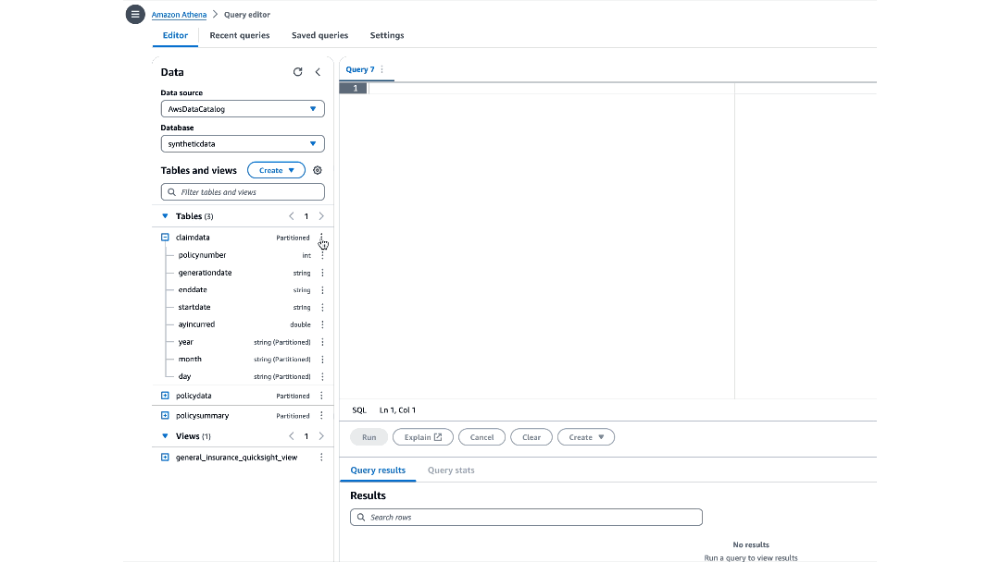

# Loading Data with InsuranceLake
{: .no_toc }

This page explains best practices for loading data using InsuranceLake.


## Contents
{: .no_toc }

* TOC
{:toc}


## Landing Source Data

The InsuranceLake ETL process is triggered when data is landed in the Collect S3 bucket.

We recommend starting your data preparation process by loading your data right away, without any configuration, so you can begin exploring your data using Athena SQL and Spark-based notebooks. This section will provide the information needed to get the best results from this process.

You can land your data in the Collect S3 bucket through:

- The [S3 Console](http://console.aws.amazon.com/s3), which can be used to create folders and drag and drop files.
- AWS SDKs or REST APIs, which can be used to embed file copying into workflows and applications.
- [AWS CLI](https://docs.aws.amazon.com/cli/latest/userguide/cli-chap-welcome.html), which can copy objects from local machines or through scripts with a full path.
- [AWS Transfer Family](https://docs.aws.amazon.com/transfer/latest/userguide/what-is-aws-transfer-family.html), which can receive data through an SFTP endpoint.
- [AWS Database Migration Service (DMS)](https://docs.aws.amazon.com/dms/latest/userguide/Welcome.html), which can [use S3 as a target](https://docs.aws.amazon.com/dms/latest/userguide/CHAP_Target.S3.html).
- [Amazon AppFlow](https://docs.aws.amazon.com/appflow/latest/userguide/what-is-appflow.html), which can be used to [transfer data from a SaaS source (for example, SalesForce) to Amazon S3](https://docs.aws.amazon.com/appflow/latest/userguide/flow-tutorial-salesforce-s3.html).

For walkthroughs, examples, and details refer to the AWS Documentation [Uploading objects to S3](https://docs.aws.amazon.com/AmazonS3/latest/userguide/upload-objects.html).

{: .important }
When you load data with no configuration, the ETL will automatically clean all column names so that they can be saved successfully in Parquet format.


## Bucket Layout

To enable transform specifications to be matched with source system data and organized in groups, each of the three ETL stage buckets (Collect, Cleanse, Consume) have similar directory layouts. The first level represents the source system name or the database that will group the underlying tables. The second layer represents the data set or table containing the uploaded data. In the Collect bucket, the source files are stored at the second layer. In the Cleanse bucket, data is converted to compressed Parquet files and stored in partitions at the second layer.

When you create the folder structure for storing source files in the Collect bucket, you are defining the folder layout for the Cleanse and Consume bucket, as well as defining the database and table organization in the Data Catalog.

* S3 objects landed with *less than two levels of folder depth* will be ignored by the state-machine-trigger Lambda function; no ETL workflow will be triggered. S3 objects landed with *more than two levels of folder depth* will be processed with [Partition Value Override](#override-partition-values).

* Data pipeline maintainers can configure the Cleanse-to-Consume AWS Glue job to create multiple tables in the Consume layer and to [override the table name](using_sql.md#override-table-name-example) provided in the folder structure. Therefore, the Consume layer will not always match the Collect bucket layout.

An example bucket layout follows:


The files for the transformation and input configuration, schema mapping, data quality rules, Athena and Spark SQL, and entity matching configuration will also follow a naming convention that matches the bucket layout.

{: .important }
This matching is **case sensitive** (Data Catalog database and table names will lose case sensitivity when created and always appear in all lowercase).

### Naming convention and location of configuration files

|Purpose  |ETL Scripts Bucket Location  |Naming Convention
|---   |---  |---
|[Schema Mapping](schema_mapping.md) |/etl/transformation-spec |`<database name>-<table name>.csv`
|[Transformation](transforms.md)/[Input Config](file_formats.md#input-specification)   |/etl/transformation-spec |`<database name>-<table name>.json`
|[Data Quality Rules](data_quality.md)   |/etl/dq-rules   |`dq-<database name>-<table name>.json`
|[Spark SQL](using_sql.md#spark-sql)   |/etl/transformation-sql  |`spark-<database name>-<table name>.sql`
|[Athena SQL](using_sql.md#athena-sql)  |/etl/transformation-sql  |`athena-<database name>-<table name>.sql`
|[Entity Match Config](https://github.com/aws-solutions-library-samples/aws-insurancelake-etl/blob/main/lib/glue_scripts/transformation-spec/Customer-entitymatch.json)   |/etl/transformation-spec |`<database name>-entitymatch.json`


## Configuration Recommendations

When the ETL loads source data with no schema mapping or transformation configuration files, it will create *recommended* configurations. These recommendations are saved to the AWS Glue job Temp S3 bucket, which follows the naming convention `<environment>-insurancelake-<account>-<region>-glue-temp`, in the folder `/etl/collect_to_cleanse`, in a file which follows the naming convention `<database>-<table>` (extension `csv` for schema mapping and `json` for transformations). Simply copy the files to your development environment, edit them as needed, and upload them to the ETL Scripts S3 bucket in the [appropriate location](#naming-convention-and-location-of-configuration-files).

Using these recommendations helps accelerate your creation of configuration files with a syntactically correct template and a complete list of fields in the schema.

More details are available on how the ETL generates these recommendations:
* [Behavior When There is No Schema Mapping](schema_mapping.md#behavior-when-there-is-no-schema-mapping)
* [Behavior When There is No Transformation Specification](transforms.md#behavior-when-there-is-no-transformation-specification)

To get started quickly building a set of data quality rules with recommendations, use [Glue Data Quality Recommendations](data_quality.md#getting-started).


## Data Profile

[AWS Glue DataBrew](https://docs.aws.amazon.com/databrew/latest/dg/what-is.html) is a visual data preparation tool that allows business analysts, data scientists, and data engineers to more easily collaborate to get insights from data. Profile jobs in DataBrew run a series of evaluations on a dataset and output the results to Amazon S3. The information that data profiling gathers helps you understand your dataset and decide what kind of data preparation steps you might want to run in your recipe jobs. For more details, refer to the AWS documentation on [creating and working with AWS Glue Databrew profile jobs](https://docs.aws.amazon.com/databrew/latest/dg/jobs.profile.html).

Follow these instructions for quickly creating a data profile for the Data Catalog tables you've created with InsuranceLake:

1. Open the [AWS Glue DataBrew](https://console.aws.amazon.com/databrew) service in the AWS Console.
1. Select `Datasets` from the navigation menu on the left.
1. Select `Connect new dataset`.
1. Under Connect to new dataset, select `Data Catalog S3 tables`.
1. Under AWS Glue databases, select **the name of the database** for the Cleanse or Consume bucket.

    {: .note }
	Data Catalog databases in the Cleanse layer will follow the naming convention of the Collect [bucket layout](#bucket-layout). Databases in the Consume layer will follow the same convention but have the [`_consume` suffix appended](using_sql.md#spark-sql).

1. Select **the radio button to the left of the table** you want to profile.
1. Check the dataset name to make sure it complies with the allowed characters.
1. Scroll to the bottom of the page and choose `Create dataset`.
1. You will now return to the Datasets screen; select the checkbox to the left of the dataset you just created.
1. Select `Run data profile`.
1. Select `Create a profile job`.
1. Customize the Data Sample selection (choose full dataset or adjust the sample size).
1. In the Job output settings section, use the Browse button to select the Glue Temp bucket following the naming convention `s3://dev-insurancelake-<AWS account ID>-<region>-glue-temp`.
1. Append a suffix: profile-output/
	- This will create a folder inside the bucket and save results in the folder.
1. Expand Data profile configurations and select `Enable PII statistics` to identify personally identifiable information (PII) columns when running the data profile job.
1. Under PII categories, select any categories you wish to check.

    {: .note }
	This option is disabled by default due to its impact on time and cost; you must enable it manually before running the data profile job.

    {: .warning }
	Take note of PII categories with a red dot to the right of the name; the dot indicates a significant impact on time and cost.

1. Keep the remaining settings at their default.
1. In the Permissions section, choose `Create new IAM role` from the Role name dropdown.
1. Enter `Profiler` as the role suffix.

    {: .note }
	This creates a new IAM role called AWSGlueDataBrewServiceRole-Profiler.

1. Select `Create and run job`.

This will take you to Data profile overview tab for the selected dataset. It will display a job in progress while running. Once the job finishes, you may observe the profile output, including statistics and identified PII rows and columns.


## File Format Identification

This section describes file format considerations when loading data for the first time.

### Auto Detection Formats

The ETL can load many source file formats for the first time with no configuration (in other words, no schema mapping file, no input/transformation specification file, no data quality file, and no SQL files). We recommend using this minimalistic configuration approach whenever possible, because it reduces the time to load and publish data.

**Comma Separated Value (CSV) is the default file format for the ETL.** If no other file format is identified or configured, the ETL will assume the file is CSV.

The table below lists the formats that could require no configuration for initial loading (with exceptions noted). Follow the provided links in the table for details on configuration options.

|Format	|Exceptions
|---	|---
|[CSV](file_formats.md#csv-comma-separated-value)	|The ETL will default to using the first row of a CSV file as the header, `"` as the quote character, and `"` as the escape character. To change these options, you must provide [an `input_spec` configuration](file_formats.md#csv-comma-separated-value). Other Spark CSV read defaults affect the way the ETL interprets CSV files. Refer to the [Spark CSV File Data Source Option Documentation](https://spark.apache.org/docs/latest/sql-data-sources-csv.html#data-source-option) for details.
|[Parquet](file_formats.md#parquet)	|Parquet files that do not end with a `parquet` extension will need to be renamed or you must provide an `input_spec` configuration indicating the file format. Multi-file Parquet data sources will require pipeline customization detailed in [Handling Multi-file Data Sets](file_formats.md#handling-multi-file-data-sets).
|[Excel](file_formats.md#microsoft-excel-format-support)	|Excel files are identified by the extensions `xls`, `xlsx`, `xlm`, `xlsm`. Loading Excel files requires the [installation of the Spark Excel libraries](file_formats.md#obtaining-the-driver). In addition, the ETL will default to using the first sheet in an Excel workbook, the data at cell A1, and assume the first row of data is the header. If your Excel file has data on a different sheet, in a different position, has no header, or requires a password, you must provide [an `input_spec` configuration](file_formats.md#configuration).
|[JSON](file_formats.md#json)	|JSON files are identified by the extensions `json`, `.jsonl`. The ETL will default to loading JSON files as JSON Lines (each line contains one JSON object). If your JSON file uses multiple lines for a single object, you must provide an `input_spec` configuration.
|[XML](file_formats.md#xml)	|XML files are identified by the extension `xml`. Loading XML files requires the [installation of the Spark XML driver](file_formats.md#xml). XML files must be row-based data. The ETL will default to a row tag of `row`. If your XML data uses a different row tag, you must provide an `input_spec` configuration.

Other formats require some configuration, even for the first load.

### TSV, Pipe-delimited, Other Delimiters

The ETL will not attempt to detect source data files containing Tab Separated Values (TSV), pipe (`|`) delimiters, or other delimiter characters. If your source data file uses a delimiter other than commas, you must specify an `input_spec` configuration indicating the file format (and optionally whether there is a header). Refer to the [Pipe-delimited file format documentation](file_formats.md#pipe-delimited) and [TSV file format documentation](file_formats.md#tsv-tab-separated-value) for configuration details.

### Fixed Width

With no configuration, the ETL will load fixed width data files as single column data sets. In order to load the source data with multiple columns, you must specify the field widths using the schema mapping configuration file. Refer to the [Fixed Width File Format Schema Mapping Documentation](schema_mapping.md#fixed-width-file-format) for details on how to do this.


## Corrupt Data

When loading source data, you will likely encounter files with some corrupt rows of data. Examples of corruption include missing columns (such as a totals row), text in numeric columns, shifted columns, and unrecognized encoding for characters in a field.

Corrupt data in source data files can cause unexpected behavior with Spark's ability to infer schema types and with performing required aggregate operations, such as a summation of a numeric column. To work around these issues and make your data pipeline more resilient, we recommend using data quality rules to quarantine corrupt data or interrupt the pipeline. Configuration details can be found in the [Data Quality with Glue Data Quality Reference](data_quality.md#configuration).

The table below shows an example data set with a totals row that causes schema problems:

|CoverageCode	|EffectiveDate	|WrittenPremium
|---	|---	|---
|WC	|2024-01-01	|50000
|Auto	|2024-02-01	|2500
|	|Total	|52500

The value of _Total_ in the `EffectiveDate` column will cause Spark to infer a field type of `string`, which is not desirable. If you simply use a `date` transform to convert the field type, Spark will convert the value _Total_ to `null`, and you will be left with an extra $52,500 of written premium. To work around this issue, you can use one of two methods:

### Method 1

This method uses a [`before_transform` data quality rule](data_quality.md#when-to-run-data-quality-rules) to quarantine the row of data with the value _Total_ in the `EffectiveDate` column. The data quality rule identifies the row by looking for values that match a standard date pattern, and removing rows that do not match. Because the `before_transform` rule runs before transforms, you can next use a [`date` transform](transforms.md#date) to convert the clean column of `data` to a date field type.

`dq-rules` configuration:
```json
{
    "before_transform": {
        "quarantine_rules": [
            "ColumnDataType 'EffectiveDate' = 'DATE'"
        ]
    }
}
```

`transformation-spec` configuration:
```json
{
	"transform_spec": {
		"date": [
			{
				"field": "EffectiveDate",
				"format": "yyyy-mm-dd"
			}
		]
	}
}
```

### Method 2

This method uses a [`filterrows` transform](transforms.md#filterrows) to remove the row of data with the value _Total_ in the `EffectiveDate` column. The `filterrows` condition looks for `null` values in the `CoverageCode` column, and filters out those rows. Because the `filterrows` transform occurs first in the `transfom_spec` section, you can next use a [`date` transform](transforms.md#date) to convert the clean column of data to a `date` field type.

`transformation-spec` configuration:
```json
{
	"transform_spec": {
		"filterrows": [
			{
				"condition": "CoverageCode is not null"
			}
		],
		"date": [
			{
				"field": "EffectiveDate",
				"format": "yyyy-mm-dd"
			}
		]
	}
}
```


## Building Dependent Workflows

Consume level views will often bring together tables from multiple workflows using a [Join](using_sql.md#join-example) or [Union](using_sql.md#union-example-with-literals-as-placeholders). If you run a multi-table view workflow when one of the referenced tables does not exist, your workflow will cause an error. If workflows have not updated one table, and another workflow joins to it, you may have missing rows (inner join) or rows with empty values (outer join). In both situations you have one workflow that depends on another.

In practice your workflow likely *does not need to be tolerant of non-existent dependent table schemas*: this is only a problem when building a workflow for the first time, or when promoting a workflow to a new environment. However, your workflow may need to *be aware of data freshness for runs beyond the first*.

To reach a more targeted solution, we recommend separating the problem of non-existent dependent tables from the problem of managing data freshness within dependent tables.

### Scenarios and workarounds for non-existent dependent tables

|Scenario	|Workaround
|---	|---
|You are building a set of workflows for the first time and do not want an error.	|First, configure all tables for the Cleanse layer<sup>&dagger;</sup> *only* so that their schema is created.<br>Second, add the Consume layer SQL for all tables<sup>&Dagger;</sup> and rerun workflows (for example, using [Step Functions New Execution capability](#execute-pipeline-without-upload)).
|You are promoting an already-built set of workflows to a new environment.	|Promote the workflow configuration after the building the Cleanse layer tables, then promote again when you add the Consume layer SQL.
|	|Copy the Cleanse layer table schema between environments in Athena using [SHOW CREATE TABLE](https://docs.aws.amazon.com/athena/latest/ug/show-create-table.html) or `Generate table DDL` from the Athena console<sup>&sect;</sup>, then promote the workflow configuration.

<sup>&dagger;</sup>Configure Cleanse layer tables using input configuration, transform specification, schema mapping, and data quality Rules. Review the [Location of Configuration Files table](#naming-convention-and-location-of-configuration-files) for more details.

<sup>&Dagger;</sup>Configure Consume layer tables using Spark and Athena views. Review the [Location of Configuration Files table](#naming-convention-and-location-of-configuration-files) for more details.

<sup>&sect;</sup>In Athena, click the vertical ellipsis to the right of the table name in the schema browser side panel. Select `Generate table DDL`, which runs a `SHOW CREATE TABLE` command. Copy and paste the query results into the editor window. Update the S3 bucket name in the `LOCATION` parameter to reference the `consume` bucket. In the side panel, change to the database with the `_consume` suffix, and execute the query.



### Scenarios and workarounds for data freshness dependencies

|Scenario	|Workaround
|---	|---
|Your dependent tables update at different frequencies and you want to ensure that the Consume layer views always have the latest data.	|Create multiple identical copies of the Consume layer SQL<sup>&dagger;</sup>, renamed for each dependent workflow, so the views are refreshed any time any of the dependent tables are updated.
|Your dependent tables update inconsistently and you want to ensure that the Consume layer view only updates when dependent tables have fresh data.	|Use [Data Freshness checks](data_quality.md#using-data-freshness-to-manage-dependent-workflows) to halt workflows or [trigger alerts](https://docs.aws.amazon.com/glue/latest/dg/data-quality-alerts.html) when dependent data is stale.
|You do not want to initiate an AWS Glue job execution if dependent tables have stale data due to cost, performance, or a concern about excessive failure notifications.	|Workflow dependency management and scheduling requires customizing InsuranceLake ETL AWS Glue job execution with services such as [Amazon EventBridge Schedules](https://docs.aws.amazon.com/eventbridge/latest/userguide/eb-create-rule-schedule.html) or [AWS Glue Triggers using a Schedule](https://docs.aws.amazon.com/glue/latest/dg/monitor-data-warehouse-schedule.html).

<sup>&dagger;</sup>Consume layer views include both Spark and Athena SQL files. For more details, refer to [Cleanse-to-Consume SQL Usage](using_sql.md).


## Execute Pipeline without Upload

If local development is not desirable or possible (for example, access to AWS account through API is restricted or testing of data quality rules is needed), you will need a method to rapidly iterate through additions, improvements, and fixes until you reach your desired state.

Using the Start Execution capability of Step Functions on historical executions allows you to quickly iterate through schema mapping, transform specification, data quality rules, and SQL changes when working with data in development. This method will ensure you replace the data in the original partition and skip the S3 file upload.

1. Navigate to [Step Functions in the AWS Console](http://console.aws.amazon.com/states).
1. Select the ETL State Machine which follows the naming convention `<environment>-insurancelake-etl-state-machine`.
1. Click on a prior execution for the workflow you want to rerun, which will open the detailed view.
1. Click `New Execution` at the top of the screen.
	
1. Inspect the execution parameters to ensure you are loading the correct source file with the correct partition values.
	
1. Optionally edit the execution name to something easier to identify in the execution history.
1. Click `Start Execution`.
	* The new execution detail will automatically open in the AWS console.

* Using this procedure allows overriding of the partition parameters in the Start Execution modal form. Simply edit the JSON formatted input parameters for `year`, `month`, and `day`.

* Step Functions execution history entries are kept for 90 days after the execution is closed. Refer to the [Step Functions AWS Documentation on Service Limits](https://docs.aws.amazon.com/step-functions/latest/dg/limits-overview.html#service-limits-state-machine-executions) for the most current details.


## Override Partition Values

For historical data loads or replacing an existing partition with new data, the InsuranceLake ETL supports defining partition values in the folder structure of the Collect bucket.

Specifically, within the table level (second level) folder, you can create a folder representing the `year` partition value, another folder representing the `month` partition value, and another folder representing the `day` partition value. The source data file can then be landed in this nested folder structure and folder names will override the values from the created date of the Collect S3 bucket source file.

When you override partition values, keep in mind the behavior of the ETL loading data in the [Cleanse](schema_evolution.md#cleanse-layer) and [Consume](schema_evolution.md#consume-layer) layers.

Example bucket layout with partition value overrides follows:


{: .note }
If you've made changes to the Collect to Cleanse AWS Glue job in order to support multi-file Parquet data sets, the partition value override functionality may be disabled. More details can be found in the [Handling Multi-file Data Sets Documentation](file_formats.md#handling-multi-file-data-sets).

Other methods to override partition values are covered in other sections of the documentation:

* Using the [Step Functions New Execution capability](#execute-pipeline-without-upload), a pipeline maintainer can repeat a previously completed workflow, skipping the file upload step, and override execution parameters such as partition year, month, day, and source file S3 location.

* AWS Glue jobs can be manually executed with override parameters for individual AWS Glue jobs. For details on how to manually initiate AWS Glue jobs and override parameters, review the [InsuranceLake Developer Documentation on AWS Glue Jobs](developer_guide.md#aws-glue-jobapache-spark-code).