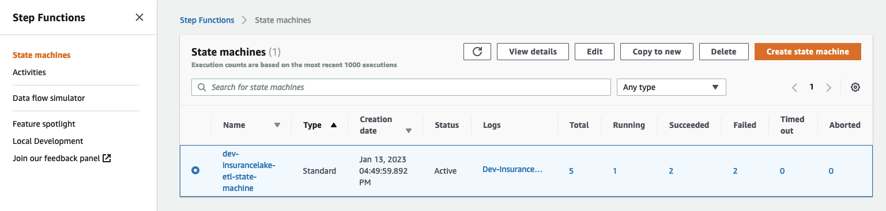
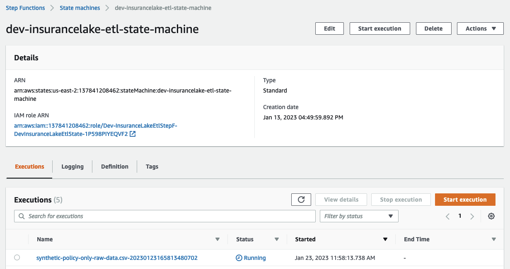

# InsuranceLake Quickstart Guide
{: .no_toc }

If you'd like to get started quickly transforming some sample raw insurance data, running SQL on the resulting dataset, **and without worrying about CI/CD**, follow the steps in this section.


## Contents
{: .no_toc }

* TOC
{:toc}


## Python/CDK Basics

1. Open the AWS Console in the `us-east-2 (Ohio)` Region.

    {: .note }
    InsuranceLake uses `us-east-2` by default. To change the Region, refer to the [Quickstart with CI/CD](quickstart_cicd.md).

1. Select AWS `CloudShell` at the bottom of the page and wait for a few seconds until it is available for use.
1. Ensure you are using the latest version of the AWS SDK for Node.js and AWS CDK.
    ```
    sudo npm install -g aws-lib aws-cdk
    ```
1. Clone the repositories.
    ```bash
    git clone https://github.com/aws-solutions-library-samples/aws-insurancelake-infrastructure.git
    git clone https://github.com/aws-solutions-library-samples/aws-insurancelake-etl.git
    ```
1. Use a terminal or command prompt and change the working directory to the location of the _infrastructure_ code.
    ```bash
    cd aws-insurancelake-infrastructure
    ```
1. Create a Python virtual environment.

    {: .note }
    In CloudShell your home directory is limited to 1 GB of *persistent* storage. To ensure we have enough storage to download and install the required Python packages, you will use CloudShell's *temporary* storage, located in `/tmp`, which has a larger capacity.

    ```bash
    python3 -m venv /tmp/.venv
    ```
1. Activate the virtual environment.
    ```bash
    source /tmp/.venv/bin/activate
    ```
1. Install required Python libraries.

    {: .note }
    You may see a warning stating that a newer version is available; it is safe to ignore this for the Quickstart.

    ```bash
    pip install -r requirements.txt
    ```
1. Bootstrap CDK in your AWS account.
    ```bash
    cdk bootstrap
    ```

## Deploy the Application

{:style="counter-reset:none"}
1. Confirm you are still in the `aws-insurancelake-infrastructure` directory.
1. Deploy infrastructure resources in the development environment (one stack).
    ```bash
    cdk deploy Dev-InsuranceLakeInfrastructurePipeline/Dev/InsuranceLakeInfrastructureS3BucketZones
    ```
1. Review and accept AWS Identity and Access Management (IAM) credential creation for the S3 bucket stack.
    - Wait for deployment to finish (approximately 5 minutes).
1. Copy the S3 bucket name for the Collect bucket to use later.
    - Bucket name will be in the form: `dev-insurancelake-<AWS Account ID>-<Region>-collect`.
1. Switch the working directory to the location of the _etl_ code.
    ```bash
    cd ../aws-insurancelake-etl
    ```
1. Deploy the ETL resources in the development environment (four stacks).
    ```bash
    cdk deploy Dev-InsuranceLakeEtlPipeline/Dev/InsuranceLakeEtlDynamoDb Dev-InsuranceLakeEtlPipeline/Dev/InsuranceLakeEtlGlue Dev-InsuranceLakeEtlPipeline/Dev/InsuranceLakeEtlStepFunctions Dev-InsuranceLakeEtlPipeline/Dev/InsuranceLakeEtlAthenaHelper
    ```
    - Wait for approximately 1 minute for DynamoDB deployment to finish.
1. Review and accept IAM credential creation for the AWS Glue jobs stack.
    - Wait approximately 3 minutes for deployment to finish.
1. Review and accept IAM credential creation for the Step Functions stack.
    - Wait approximately 7 minutes for deployment of Step Functions and Athena Helper stacks to finish.

## Try out the ETL Process

{:style="counter-reset:none"}
1. Populate the DynamoDB lookup table with sample lookup data.
    ```bash
    resources/load_dynamodb_lookup_table.py SyntheticGeneralData dev-insurancelake-etl-value-lookup resources/syntheticgeneral_lookup_data.json
    ```
1. Transfer the sample claim data to the Collect bucket.
    ```bash
    aws s3 cp resources/syntheticgeneral-claim-data.csv s3://<Collect S3 bucket>/SyntheticGeneralData/ClaimData/
    ```
1. Transfer the sample policy data to the Collect bucket.
    ```bash
    aws s3 cp resources/syntheticgeneral-policy-data.csv s3://<Collect S3 bucket>/SyntheticGeneralData/PolicyData/
    ```
1. Open [Step Functions](https://console.aws.amazon.com/states/home) in the AWS Console and select `dev-insurancelake-etl-state-machine`.
    
1. Open the state machine execution in progress and monitor the status until complete.
    
1. Open [Athena](https://console.aws.amazon.com/athena/home) in the AWS Console.
1. Select `Launch Query Editor`, and change the Workgroup to `insurancelake`.
1. Run the following query to view a sample of prepared data in the consume bucket:
    ```sql
    select * from syntheticgeneraldata_consume.policydata limit 100
    ```

## Next Steps

* Take the [InsuranceLake Deep Dive Workshop](https://catalog.us-east-1.prod.workshops.aws/workshops/0a85653e-07e9-41a8-960a-2d1bb592331b).
    * You may skip to the [Modify and test a transform](https://catalog.us-east-1.prod.workshops.aws/workshops/0a85653e-07e9-41a8-960a-2d1bb592331b/en-US/modify-a-transform) step, as the prior steps overlap with the Quickstart instructions.
* Try out [loading your own data](loading_data.md#landing-source-data).
* Try the [Quickstart with CI/CD](quickstart_cicd.md).
* Dive deeper with the included [user documentation](user_documentation.md).
* Contact your AWS account team for a solution deep dive, workshops, or AWS Professional Services support.