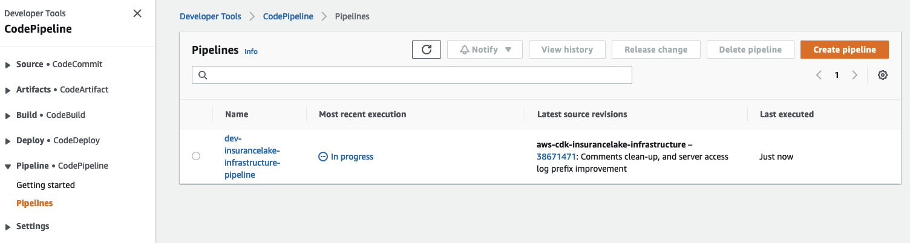
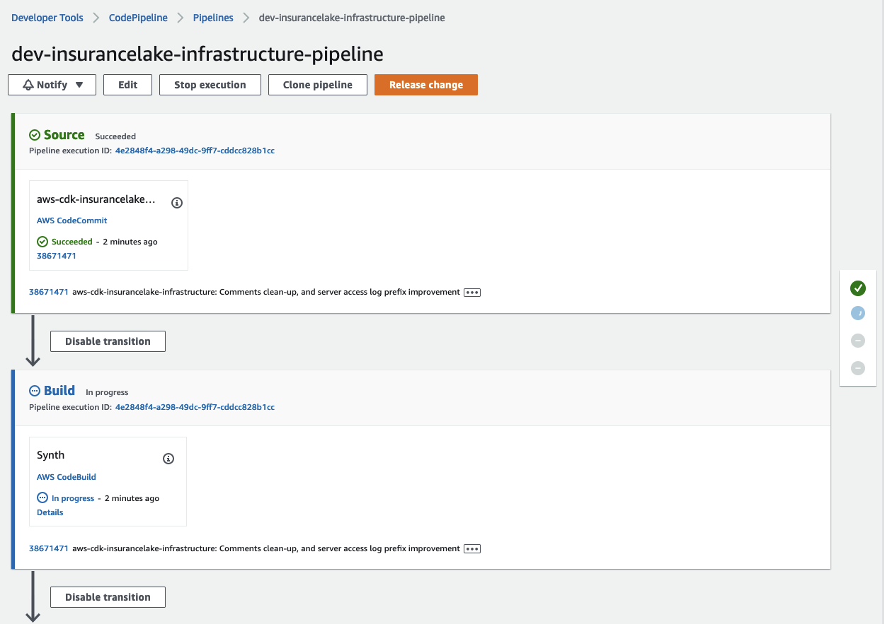
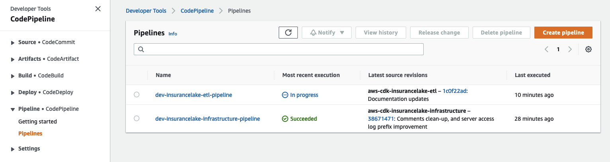
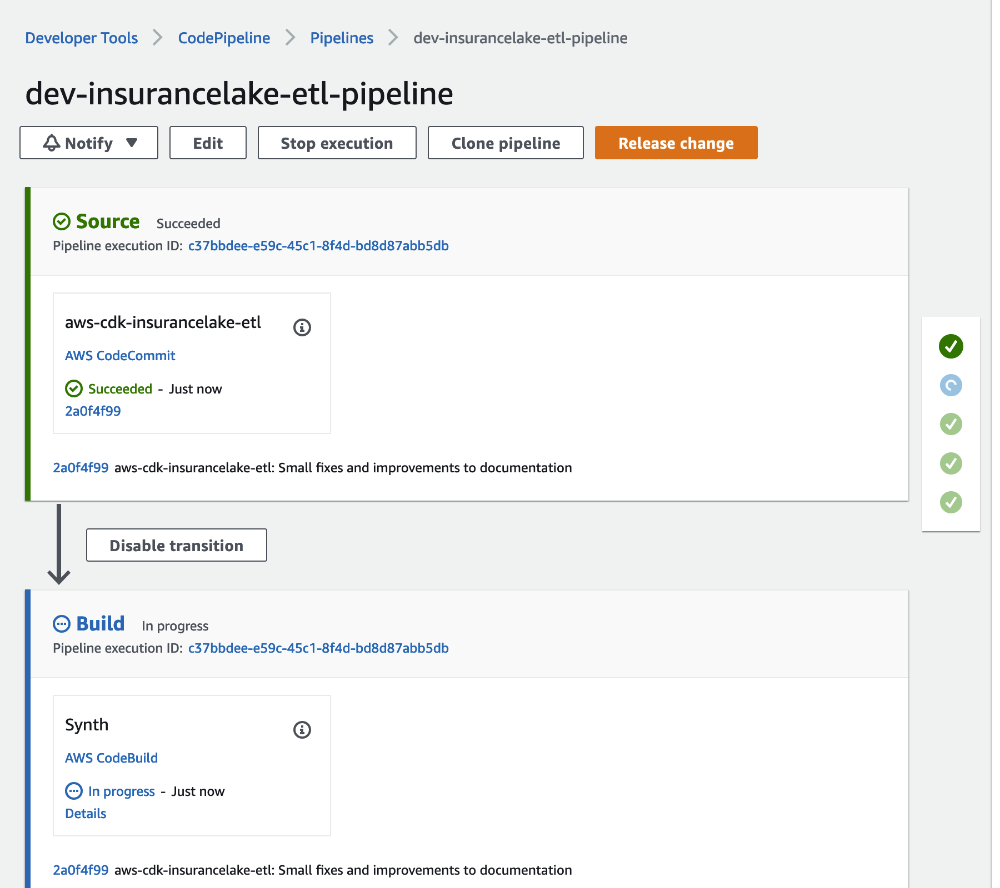

# InsuranceLake Quickstart with CI/CD Guide

If you've determined that InsuranceLake is a good starting point for your own serverless data lake and would like to rapidly iterate through development cycles with one or more teammates, we recommend deploying it with a CI/CD pipeline.

The steps in this section assume you want to develop and deploy locally. Follow the steps to create your CodePipeline stack and to use it to deploy the InsuranceLake resources.

1. If this is your first time using the application in this environment, follow the [CDK Instructions](cdk_instructions.md) steps to setup your local environment for AWS CDK development.

1. You will likely need to make configuration changes to the code. Ensure that you have [forked the repository on Github](https://docs.github.com/en/pull-requests/collaborating-with-pull-requests/working-with-forks/fork-a-repo#use-someone-elses-project-as-a-starting-point-for-your-own-idea) or copied the source code to a separate repository.

    {: .note}
    Refer to [Copy OpenSource Git Repositories](developer_guide.md#copy-opensource-git-repositories) for steps on copying the source code to a local repository.

1. Clone the repositories locally.

    {: .note}
    Modify the below commands to use the correct URL for your repositories. Subsequent steps will assume you are using the repository names `aws-insurancelake-infrastructure` and `aws-insurancelake-etl`.

    ```bash
    git clone https://path/to/aws-insurancelake-infrastructure
    git clone https://path/to/aws-insurancelake-etl
    ```

1. Use a terminal or command prompt and change the working directory to the location of the infrastruture code.
    ```bash
    cd aws-insurancelake-infrastructure
    ```

1. Open the `lib/configuration.py` file using `vi` or `nano`.
    ```bash
    nano +77 lib/configuration.py
    ```
    ```bash
    vi +77 lib/configuration.py
    ```

1. Review the `local_mapping` structure in the `get_local_configuration()` function and make changes where necessary.
    - Specifically, the Regions and account IDs should make sense for your environments. These values in the repository (not locally) will be used by AWS CodePipeline and need to be maintained **in the repository**.
    - The values for the Test and Production environments can be ommitted at this time, because we will only be deploying the Deployment and Development environments in the same account.
    - You must explicitly specify the account and Region for each environment so that the infrastructure virtual private clouds (VPCs) get three Availability Zones. [Review the reference documentation](https://docs.aws.amazon.com/cdk/api/v2/docs/aws-cdk-lib.aws_ec2.Vpc.html#maxazs).
    - Refer to [Application Configuration](full_deployment_guide.md#application-configuration) from the Full Deployment Guide for more details on configuration parameters.

1. If you modified the configuration, copy `configuration.py` file to the ETL repository.

    ```bash
    cp lib/configuration.py ../aws-insurancelake-etl/lib/
    ```

1. Edit the `configuration.py` in the ETL repository and modify the repository configuration parameters to reference the ETL code repository.

    {: .note }
    We recommend that you keep the logical ID prefix and resource name prefix consistent between repositories.

1. Create a CodeConnections connection for your forked repository and configure the repository parameters by following the [AWS CodePipeline and Git Integration guide](full_deployment_guide.md#aws-codepipeline-and-git-integration).

1. Bootstrap CDK in your AWS account.
    ```bash
    cdk bootstrap
    ```

1. Deploy the Infrastructure CodePipeline stack in the development environment (one stack).
    ```bash
    cdk deploy Dev-InsuranceLakeInfrastructurePipeline
    ```

1. Review and accept IAM credential creation for the CodePipeline stack.
    - Wait for deployment to finish (approximately 5 minutes).

1. Open [CodePipeline](https://console.aws.amazon.com/codesuite/codepipeline/pipelines) in the AWS Console and select the `dev-insurancelake-infrastructure-pipeline` Pipeline.
    - The first run of the pipeline starts automatically after the Pipeline stack is deployed.
    

1. Monitor the status of the pipeline until complete.
    

1. Switch the working directory to the location of the ETL code.
    ```bash
    cd ../aws-insurancelake-etl
    ```

1. Deploy the ETL CodePipeline stack in the development environment (one stack).
    ```bash
    cdk deploy Dev-InsuranceLakeEtlPipeline
    ```

1. Review and accept IAM credential creation for the CodePipeline stack.
    - Wait for deployment to finish (approximately 5 minutes).

1. Open [CodePipeline](https://console.aws.amazon.com/codesuite/codepipeline/pipelines) in the AWS Console and select the `dev-insurancelake-etl-pipeline` Pipeline.
    - The first run of the pipeline starts automatically after the Pipeline stack is deployed.
    

1. Monitor the status of the pipeline until completed.
    

You can now make changes locally, commit them to the repository, and CodePipeline will automatically deploy them to your AWS account.

## Further Reading

- [Local AWS Glue and Apache Spark Development](developer_guide.md#local-aws-glue-and-apache-spark-development)
- [InsuranceLake Code Quality](developer_guide.md#code-quality)
- [Unit Testing](developer_guide.md#unit-testing)