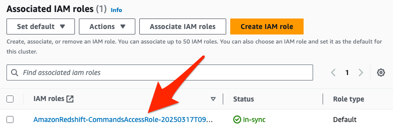
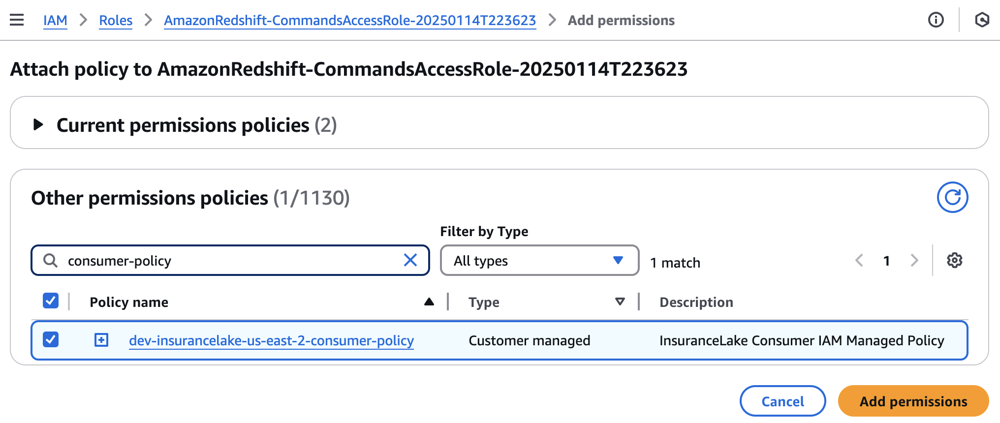
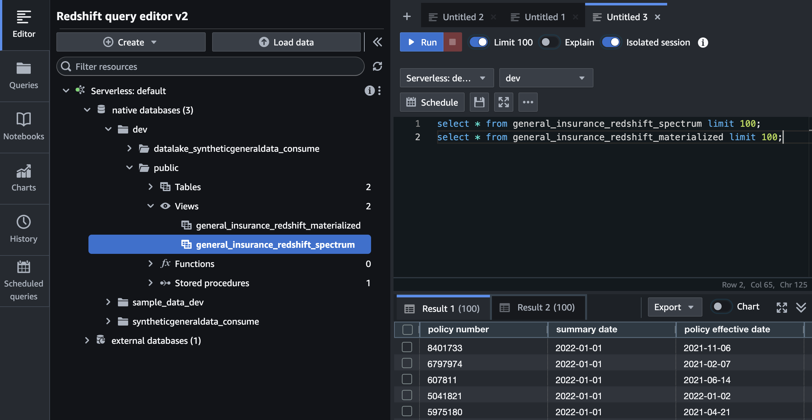
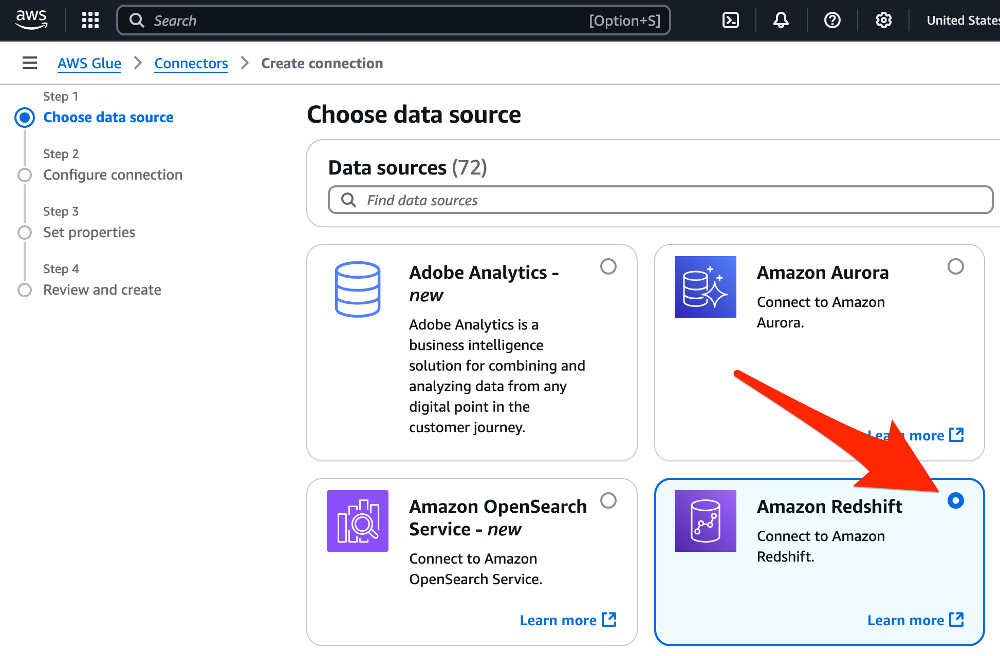
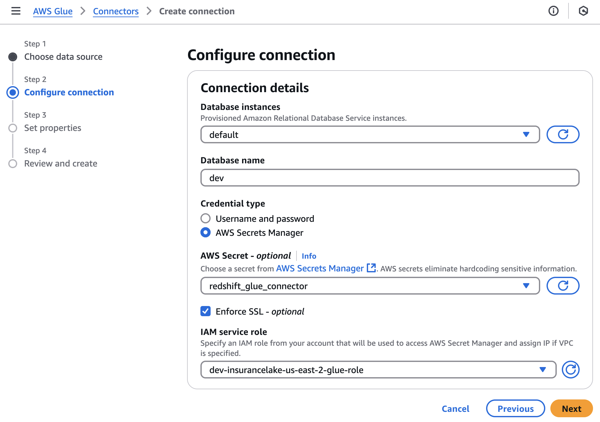
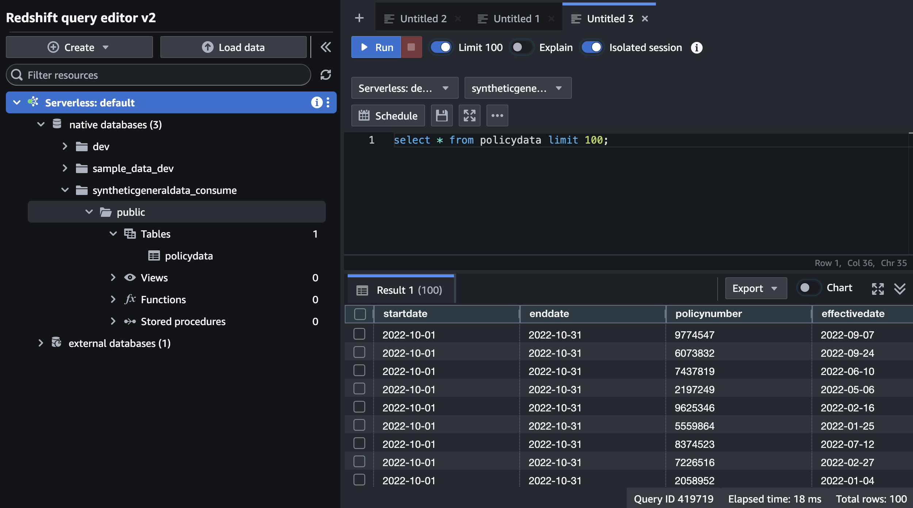

# Amazon Redshift Integration Guide
{: .no_toc }

This section provides instructions for configuring [Amazon Redshift](https://docs.aws.amazon.com/redshift/latest/mgmt/welcome.html) to query data in tables created by InsuranceLake and to enable InsuranceLake to create Amazon Redshift views of data lake data.


## Contents
{: .no_toc }

* TOC
{: toc }


## Amazon Redshift integration options

You can use an [Amazon Redshift provisioned cluster](https://docs.aws.amazon.com/redshift/latest/mgmt/working-with-clusters.html) or an [Amazon Redshift Serverless](https://docs.aws.amazon.com/redshift/latest/mgmt/serverless-whatis.html) workgroup to directly query Data Catalog tables. You can optionally register databases in the Data Catalog created by InsuranceLake as Amazon Redshift external schemas, and create materialized views for improved query performance from Amazon Redshift's optimized compute engine.

Access to the data lake data from Amazon Redshift relies on [Amazon Redshift Spectrum](https://docs.aws.amazon.com/redshift/latest/dg/c-getting-started-using-spectrum.html#c-getting-started-using-spectrum-prerequisites), which requires that the workgroup or cluster be located in the same AWS Region as the data lake.

You can also use AWS Glue ETL jobs to write data directly to Amazon Redshift Managed Storage through AWS Glue connections. AWS Glue connections rely on VPC connectivity between ETL jobs and your Amazon Redshift database.

The following sections cover the setup and testing of each integration option. Some setup steps are common to multiple integration options, which will be identified in the guide.


## Common setup

This section covers steps that are common to all 3 methods of integration with Amazon Redshift.

{: .important}
The instructions in the following sections assume you have completed the [Quickstart guide](quickstart.md) and loaded the provided sample data into Data Catalog tables.


### Provisioned cluster or serverless workgroup

If you need to create an Amazon Redshift Serverless workgroup or cluster, follow the respective getting started guides:
* [Get started with Amazon Redshift Serverless](https://docs.aws.amazon.com/redshift/latest/gsg/new-user-serverless.html)
* [Get started with Amazon Redshift Provisioned](https://docs.aws.amazon.com/redshift/latest/gsg/new-user.html)

Ensure you can connect to Amazon Redshift with **superuser privileges**. You do not need an Amazon Redshift user associated with an IAM identity unless specifically indicated.

Ensure you have followed the [CDK Instructions](cdk_instructions.md) for local deployment setup.


### Amazon Redshift permissions for AWS Glue

AWS Glue ETL jobs must have the correct permissions to access your Amazon Redshift resources and execute SQL statements. Follow the below steps to adjust the InsuranceLake AWS Glue stack so that the IAM role used by ETL jobs has these permissions.

1. Add the following policy document to `get_glue_role` starting at line 502 in [glue_stack.py](https://github.com/aws-solutions-library-samples/aws-insurancelake-etl/blob/main/lib/glue_stack.py#L502), the InsuranceLake AWS Glue stack.

    {: .important}
    Modify the below code to use the correct ARN for your Amazon Redshift Serverless workgroup or cluster.
    ARNs for Amazon Redshift Serverless workgroups follow the convention:
    `arn:aws:redshift-serverless:<REGION>:<ACCOUNT ID>:workgroup/<WORKGROUP UUID>`.
    ARNs for Amazon Redshift Provisioned clusters follow the convention: `arn:aws:redshift:<REGION>:<ACCOUNT ID>:cluster:<CLUSTER ID>` and `arn:aws:redshift:<REGION>:<ACCOUNT ID>:dbname:<CLUSTER ID>/*`.

    ```python
                    'RedshiftAccess':
                    iam.PolicyDocument(statements=[
                        iam.PolicyStatement(
                            effect=iam.Effect.ALLOW,
                            actions=[
                                'redshift-data:ExecuteStatement',
                                'redshift-data:BatchExecuteStatement',
                                'redshift-serverless:GetCredentials',
                                'redshift:GetClusterCredentialsWithIAM',
                            ],
                            resources=[
                                '<CLUSTER OR WORKGROUP ARN>',
                                '<CLUSTER DATABASE>',
                            ]
                        ),
                        iam.PolicyStatement(
                            effect=iam.Effect.ALLOW,
                            actions=[
                                'redshift-data:GetStatementResult',
                                'redshift-data:CancelStatement',
                                'redshift-data:DescribeStatement',
                            ],
                            resources=[ '*' ],
                            conditions={
                                'StringEquals': {
                                    'redshift-data:statement-owner-iam-userid': '${aws:userid}'
                                }
                            }
                        
                        ),
                    ]),
    ```

1. Using CDK, redeploy the AWS Glue stack.

    ```bash
    cdk deploy Dev-InsuranceLakeEtlPipeline/Dev/InsuranceLakeEtlGlue
    ```

1. Identify the IAM role for the InsuranceLake AWS Glue ETL jobs, which follows the naming convention `<environment>-insurancelake-<region>-glue-role`.

    1. If you do not know the name of the role, you can find it in the [CloudFormation console](https://console.aws.amazon.com/cloudformation).
    1. Select the InsuranceLake AWS Glue stack, `<Environment>-InsuranceLakeEtlGlue`.
    1. Select the `Outputs` tab.
    1. Find the value for the export named `<Environment>InsuranceLakeGlueRole`. This is the IAM role for AWS Glue ETL jobs.

1. Open the [Amazon Redshift query editor](https://console.aws.amazon.com/sqlworkbench/home#/client) as a superuser.

1. Run the following SQL to grant the InsuranceLake AWS Glue ETL jobs role access to your Amazon Redshift database and the Data Catalog through Amazon Redshift Spectrum.

    {: .note }
    In the below SQL, you will explicitly create the Amazon Redshift user for the AWS Glue job IAM role so the `GRANT` statements succeed. Normally, the first connection by the role to Amazon Redshift would create the user automatically; however, the first run will fail due to missing permissions.

    {: .important }
    Adjust the following SQL statements to use the correct AWS Glue role name and Amazon Redshift database name.

    ```sql
    CREATE USER "IAMR:dev-insurancelake-us-east-2-glue-role" PASSWORD DISABLE;
    GRANT USAGE ON DATABASE "awsdatacatalog" TO "IAMR:dev-insurancelake-us-east-2-glue-role";
    GRANT CREATE ON DATABASE "dev" TO "IAMR:dev-insurancelake-us-east-2-glue-role";
    ```


## Create data lake views in Amazon Redshift

### Data lake permissions

Your Amazon Redshift workgroup or cluster must have the correct permissions to access the data lake. InsuranceLake deployment creates a customer-managed IAM policy that you can use to provide this access.

1. Identify the default IAM role used by the cluster or the workgroup's namespace in the [Amazon Redshift management console](https://console.aws.amazon.com/redshiftv2).
    

1. Select the IAM role name to open it in AWS Console.

1. Select `Add permissions`, then `Attach policies`.

1. Search for the InsuranceLake customer-managed policy, which follows the naming convention `<environment>-insurancelake-<region>-consumer-policy`, and select the checkbox to the left of the InsuranceLake.

    1. If you do not know the name of the policy, you can find it in the [CloudFormation console](https://console.aws.amazon.com/cloudformation).
    1. Select the InsuranceLake AWS Glue stack, `<Environment>-InsuranceLakeEtlGlue`.
    1. Select the `Outputs` tab.
    1. Find the value for the export named `<Environment>InsuranceLakeConsumerPolicy`. This is the customer-managed policy to attach.

1. Attach InsuranceLake customer-managed policy to the role by selecting `Add permissions`.

    {: .warning }
    This policy grants the IAM role permissions to decrypt using the InsuranceLake KMS key, and read from InsuranceLake Amazon S3 buckets (Cleanse and Consume) and Data Catalog.

    


### Database connection parameters

The Cleanse-to-Consume AWS Glue job requires extra parameters to create views in Amazon Redshift.

|Parameter Name     |Type   |Description
|---    |-- |--
|redshift_database  |Always required    |Database name
|redshift_workgroup_name    |Required for Amazon Redshift Serverless |Workgroup name
|redshift_cluster_id    |Required for Amazon Redshift Provisioned    |Cluster ID

AWS Glue job parameters can be specified in several ways: in a `StartJobRun` API call, SDK command, or CLI command; by modifying the AWS Glue ETL job parameters (under `Job details`, `Advanced properties`); and by modifying the task node `DevInsuranceLakeCleanseGlueJobTask` in the InsuranceLake Step Function State Machine definition. **We recommend modifying the Step Functions State Machine and using CDK to deploy the change.**

Follow the steps below to add these parameters to the InsuranceLake data pipeline.

1. Prepare the set of parameters. Ensure the database, workgroup name, and cluster ID match the names in your environment.

    * For a serverless workgroup, use `redshift_database` and `redshift_workgroup_name`. Example follows.
        ```
        --redshift_database=dev
        --redshift_workgroup_name=default
        ```

    * For a provisioned cluster, use `redshift_database` and `redshift_cluster_id`. Example follows.
        ```
        --redshift_database=dev
        --redshift_cluster_id=redshift-cluster-1
        ```

1. Add two additional arguments to `glue_cleanse_task` starting at line 164 in [step_functions_stack.py](https://github.com/aws-solutions-library-samples/aws-insurancelake-etl/blob/main/lib/step_functions_stack.py#L164), the InsuranceLake Step Functions stack.

    {: .important}
    Adjust the following code section to use the parameters you identified in the previous step.

    This example is for an Amazon Redshift Serverless workgroup:
    ```python
            glue_cleanse_task = self.get_glue_job_task(
                'Cleanse', 'Cleanse to Consume data load and transform',
                cleanse_to_consume_job.name, failure_function_task,
                arguments={
                    '--source_database_name.$': '$.target_database_name',
                    '--target_database_name.$': "States.Format('{}_consume', $.target_database_name)",
                    '--base_file_name.$': '$.base_file_name',
                    '--redshift_database': 'dev',
                    '--redshift_workgroup_name': 'default',
                },
            )
    ```

1. Using CDK, redeploy the Step Functions stack.

    ```bash
    cdk deploy Dev-InsuranceLakeEtlPipeline/Dev/InsuranceLakeEtlStepFunctions
    ```

### Query data lake views from Amazon Redshift

1. Access the [Amazon Redshift query editor](https://console.aws.amazon.com/sqlworkbench/home#/client).

1. In the tree-view pane, expand `external databases` and the `awsdatacatalog` schema. Notice the Data Catalog databases and tables like `syntheticgeneraldata` and `policydata`.

1. If you see the error, `The current user is not authenticated with IAM credentials`, edit the connection by clicking the vertical ellipsis next to the Amazon Redshift connection.

    1. Choose `Temporary credentials using your IAM identity`, or `Federated user` under `Other ways to connect`.
    1. Select `Create connection`.

1. Run the following query. Notice that the dataset is the same as [what was shown in Athena](quickstart.md#try-out-the-etl-process).
    ```sql
    SELECT * FROM awsdatacatalog.syntheticgeneraldata_consume.policydata LIMIT 100;
    ```


## Create materialized views in Amazon Redshift

Materialized views of data lake data in Amazon Redshift **require the same steps as [data lake views in Amazon Redshift](#data-lake-views-in-amazon-redshift)**, as well as the steps to create an external schema and grant permissions below.


### Create an external schema

If you want to create materialized views in Amazon Redshift that use data lake data, follow these steps to create an external schema. **You must create an external schema for each data lake database you want to access.**

{: .important}
Ensure you have successfully run a workflow to create each database before running these commands, or that you have manually created the databases. The Data Catalog database must exist for the commands to work.

1. Create an external schema based on the InsuranceLake database in the Data Catalog. This query creates an external schema `datalake_syntheticgeneraldata_consume`. The name following the `DATABASE` identifier must match the name of the Data Catalog database created by InsuranceLake.

    {: .note}
    For a full list of parameters refer to the [Create External Schema](https://docs.aws.amazon.com/redshift/latest/dg/r_CREATE_EXTERNAL_SCHEMA.html) documentation.

    ```sql
    CREATE EXTERNAL SCHEMA IF NOT EXISTS "datalake_syntheticgeneraldata_consume"
    FROM DATA CATALOG
    DATABASE 'syntheticgeneraldata_consume'
    IAM_ROLE DEFAULT;
    ```

1. Grant the AWS Glue role access to the external schema.

    {: .note}
    See the steps in [Amazon Redshift permissions for AWS Glue](#amazon-redshift-permissions-for-aws-glue) to identify the correct IAM role name and modify the below SQL accordingly.

    ```sql
    GRANT USAGE ON SCHEMA "datalake_syntheticgeneraldata_consume" TO "IAMR:dev-insurancelake-us-east-2-glue-role";
    GRANT SELECT ON ALL TABLES IN SCHEMA "datalake_syntheticgeneraldata_consume" TO "IAMR:dev-insurancelake-us-east-2-glue-role";
    ```

1. Grant other users or groups access to the external schema as needed.

1. Repeat these steps for other databases as needed.

For more details and examples of creating materialized views using the external schemas created above, see the [Amazon Redshift SQL](using_sql.md#amazon-redshift-sql) section of the InsuranceLake Cleanse-to-Consume SQL Usage Documentation.


### Create and query materialized views from Amazon Redshift

{: .note}
These instructions assume you have completed the [Quickstart guide](quickstart.md) and loaded the provided sample data into Data Catalog tables.

1. Trigger the `CombinedData` demonstration workflow.

    1. Copy and paste the following text into a local file, `trigger.csv` (the timestamp value is not important).
        ```
        Description,Timestamp
        Demonstration run,2025-03-28 12:00:00
        ```

    1. Run the following Amazon S3 copy command, substituting the S3 path for your InsuranceLake Collect bucket.
        ```bash
        aws s3 cp trigger.csv s3://<Collect S3 bucket>/SyntheticGeneralData/CombinedData/
        ```

1. Use the [Step Functions console](https://console.aws.amazon.com/states/home) to monitor the progress of the workflow.

1. When the workflow completes, access the [Amazon Redshift query editor](https://console.aws.amazon.com/sqlworkbench/home#/client).

1. Refresh the tree-view pane using the circular arrows icon, and notice that you now have 2 views in the `dev` database, `public` schema.

1. Run the following Amazon Redshift SQL to check the contents of the 2 new views:
    ```sql
    select * from general_insurance_redshift_spectrum limit 100;
    select * from general_insurance_redshift_materialized limit 100;
    ```

    

Other example queries using Amazon Redshift SQL:
* [Simple Amazon Redshift Materialized View](using_sql.md#simple-amazon-redshift-materialized-view)
* [Box Plot Amazon Redshift View](using_sql.md#box-plot-amazon-redshift-spectrum-view)


## Use Amazon Redshift for Consume layer storage

This section provides guidance for you to configure the Cleanse-to-Consume AWS Glue ETL job to write directly to Amazon Redshift Managed Storage in the Consume layer of your data lakehouse.

The following instructions use a Data Catalog Connection for the connectivity to Amazon Redshift. The Data Catalog Connection provisions the VPC automatically and retrieves Amazon Redshift credentials from AWS Secrets Manager.


### Prerequisites

* **You have a shared VPC for AWS Glue ETL jobs and Amazon Redshift database.**

    You can use InsuranceLake to provision the VPC and create the Redshift workgroup or cluster in the VPC created by InsuranceLake. For more information on configuring a VPC deployment with InsuranceLake, refer to the [Application Configuration section of the Full Deployment guide](./full_deployment_guide.md#application-configuration).
    
    Alternatively you can bring your own VPC, create connections to each subnet under [Data Catalog Connections](https://console.aws.amazon.com/gluestudio/home#/connectors), and connect your [AWS Glue ETL jobs](https://console.aws.amazon.com/gluestudio/home#/jobs) under `Job Details`, `Advanced Properties`, `Connections`.

* **Your VPC must have sufficient IP addresses available for service endpoints and Amazon Redshift.**

    InsuranceLake provisions your VPC using 3 Availability Zones, each with a public and private subnet. This divides the VPC subnet by 6, rounding down to the nearest power of 2. For example, if you specify a /24 VPC subnet in your InsuranceLake configuration, you will have 32 IP addresses in each private subnet.

    AWS reserves 5 IP addresses in each subnet (1 network, 1 broadcast, 1 gateway, and 2 reserved). In addition, InsuranceLake VPCs are automatically deployed with 8 service endpoints, each of which uses an additional IP address. In the previous example, the 32 IP address subnet will have 19 available IP addresses.

    If you bring your own VPC, you might have different subnet divisions and service endpoints.

    Amazon Redshift Serverless workgroups and clusters have varying IP address requirements depending on the RPUs. For details refer to [Considerations when using Amazon Redshift Serverless](https://docs.aws.amazon.com/redshift/latest/mgmt/serverless-usage-considerations.html).

* **You have followed the [Amazon Redshift permissions for AWS Glue](#amazon-redshift-permissions-for-aws-glue) instructions above.**

    The AWS Glue ETL job IAM role must have access to the Amazon Redshift cluster or workgroup. In the following steps, you will need to grant additional permissions to the AWS Glue ETL job IAM role and should know the role name. You do not need to grant access to the Data Catalog.


### Connector setup

1. In the [Amazon Redshift query editor](https://console.aws.amazon.com/sqlworkbench/home#/client), ensure you are connected to the correct workgroup or cluster.

1. Create a user for the Data Catalog Connection with a password.

    ```sql
    CREATE USER glue_connector PASSWORD '<PASSWORD>';
    ```

1. Create and grant access to each database the ETL job will write to.

    {: .note}
    You must create each database in Amazon Redshift and grant permissions to the AWS Glue ETL job IAM role in advance of writing any data. The ETL job will create tables automatically.

    ```sql
    CREATE DATABASE "syntheticgeneraldata_consume";
    GRANT CREATE ON DATABASE "syntheticgeneraldata_consume" TO "IAMR:dev-insurancelake-us-east-2-glue-role";
    ```

1. Create a Secrets Manager secret with the username and password you created in the prior steps.

    If you are already managing your Amazon Redshift credentials with a Secrets Manager secret, you can use the same secret for the AWS Glue Connector and skip this step.

    Refer to [Creating a secret for Amazon Redshift database connection credentials](https://docs.aws.amazon.com/redshift/latest/mgmt/redshift-secrets-manager-integration-create.html) for specific instructions.

    {: .important}
    The AWS Glue ETL job IAM role must have access to the encryption key you choose. We recommend using the InsuranceLake KMS key, `dev-insurancelake-kms-key`, because the AWS Glue ETL job IAM role already has access to decrypt using this key.

1. Grant the AWS Glue IAM role access to the Secrets Manager secret containing your Amazon Redshift credentials.

    Use the following policy statement as an inline policy for the IAM role:
    ```json
    {
        "Effect": "Allow",
        "Action": "secretsmanager:GetSecretValue",
        "Resource": "<ARN FOR SECRETS MANAGER SECRET>"
    }
    ```

1. Attach the AWS managed policy `AmazonVPCFullAccess` to the AWS Glue ETL job IAM role to allow it to automatically provision the VPC.

1. Create the Data Catalog Connection in the [AWS Glue console](https://console.aws.amazon.com/gluestudio/home#/connectors).

    1. Select `Data connections` from the navigation menu on the left.

    1. In the `Connections` section, select `Create connection`.

    1. Select Amazon Redshift as the data source and click `Next`. You can filter the list of data sources to help find it.

        

    1. Under `Database instances`, choose the workgroup or cluster to connect to.

    1. For `Database name`, select a database from the list.

        {: .note}
        The database name you choose in the connection details will not be used by the ETL workflow. Any valid database can be used to create the connector.

    1. For `Credential type`, select AWS Secrets Manager, then select the secret containing your Amazon Redshift credentials.

    1. Check `Enforse SSL`.

    1. For `IAM service role`, select the AWS Glue ETL job IAM role from the dropdown.

        

    1. Select `Next`, `Next` again, then `Create connection`.


### Cleanse-to-Consume ETL job modification

In this section, you will modify the InsuranceLake Cleanse-to-Consume ETL job to write to Amazon Redshift Managed Storage instead of Amazon S3.

1. Edit the [Cleanse-to-Consume AWS Glue script](https://github.com/aws-solutions-library-samples/aws-insurancelake-etl/blob/main/lib/glue_scripts/etl_cleanse_to_consume.py#L158) starting on line 158.

    1. Comment or delete the code on lines 158 - 191. This section of the code sets the storage location, updates the Data Catalog, purges the S3 path, sets Spark write parameters, and writes the data to S3.

    1. Add the following replacement code, which is used to write data directly to Amazon Redshift.

        {: .important}
        Change the `catalog_connection` parameter to match the Data Catalog Connection name created in the [Connector setup](#connector-setup).

        ```python
                dyf = DynamicFrame.fromDF(filtered_df, glueContext, f"{args['execution_id']}-convertforredshift")
                glueContext.write_dynamic_frame.from_jdbc_conf(
                    frame=dyf,
                    catalog_connection='Redshift connection',
                    connection_options={
                        'database': args['target_database_name'].lower(),
                        'dbtable': f'{target_table}',
                    },
                    redshift_tmp_dir=args['TempDir'],
                    transformation_ctx=f"{args['execution_id']}-redshiftwrite"
                )
        ```

        For full details on connection options refer to [Amazon Redshift connection option reference](https://docs.aws.amazon.com/glue/latest/dg/aws-glue-programming-etl-redshift.html#w9aac67c11c24b8c21c15) and [JDBC connection option reference](https://docs.aws.amazon.com/glue/latest/dg/aws-glue-programming-etl-connect-jdbc-home.html#aws-glue-programming-etl-connect-jdbc).

    1. Add an additional import at line 9.

        ```python
        from awsglue.dynamicframe import DynamicFrame
        ```

1. Using CDK, redeploy the AWS Glue stack.

    ```bash
    cdk deploy Dev-InsuranceLakeEtlPipeline/Dev/InsuranceLakeEtlGlue
    ```


### Query Amazon Redshift Consume layer

1. Rerun the [`PolicyData` workflow](quickstart.md#try-out-the-etl-process) to publish data to Amazon Redshift Managed Storage and wait for the job to complete.

    {:. note}
    If you have recently run the `PolicyData` workflow, you can [execute the pipeline without upload](loading_data.md#execute-pipeline-without-upload).

1. Use the following query in the [Amazon Redshift query editor](https://console.aws.amazon.com/sqlworkbench/home#/client) to check the data in the Consume layer:

    ```sql
    select * from syntheticgeneraldata_consume.public.policydata limit 100;
    ```

    